# The Cocktail Compendium — Mike & Nat's Journal

*An illustrated reference distilled from our chat archive, May 2020 – June 2026.*

**26 made · 56 inspirations to try · 13 classics · 38 syrups & techniques · 13 kitchen recipes.**  Photos live alongside this file in `images/`. Everything is also in the interactive **Cocktail Compendium** app (tabs: *The Bar* with Made / Inspirations / Classics / Syrups chips, and *The Kitchen*).

> Standard IBA classics you'd already made (a plain Daiquiri, Whiskey Sour, Gin Basil Smash, Tom Collins, Tequila Sunrise, Tommy's Margarita) were folded into the official 102 to avoid duplication — their photos now sit on those official cards.

---

## 🍸 Made — Tested & House Originals  (26)

*Drinks you actually built and tasted.*

### · Agave — Tequila & Mezcal ·

### Batch Clarified Margarita (2L/1L)

**Method:** Stirred

- **375** 750ml Blanco Teq
- **185** 370ml Cointreau
- **220** 440ml Fresh Lime Juice
- **220 ml** 1:1 Water/AgaveNectar (55,55)
- Heavy pinch of salt
- **155** 310ml Whole Milk
- 1) mix everything except milk
- 5) drip back into bottle
- do not stir when adding milk
- 1h wait to curdle

*Method.* serve over clear ice, express Lime peel  and garnish

> 2) add milk slowly and sit for 1h · 3) drip through 2 wet coffee filter paper over cup or beaker · 4) first drops will be cloudy so reintroduce that back into mix · Notes (half recipe): · milk can be added to any acidic cocktail. Add 25% of batch volume as milk · used coffee cloth instead of filter, takes 75 min to filter · filter layer must form (refilter first few drops as stage 4) · Makes 870 ml [source: instagram.com]

`agave`  `batch`  `coffee/dessert`

### Butterscotch Margarita

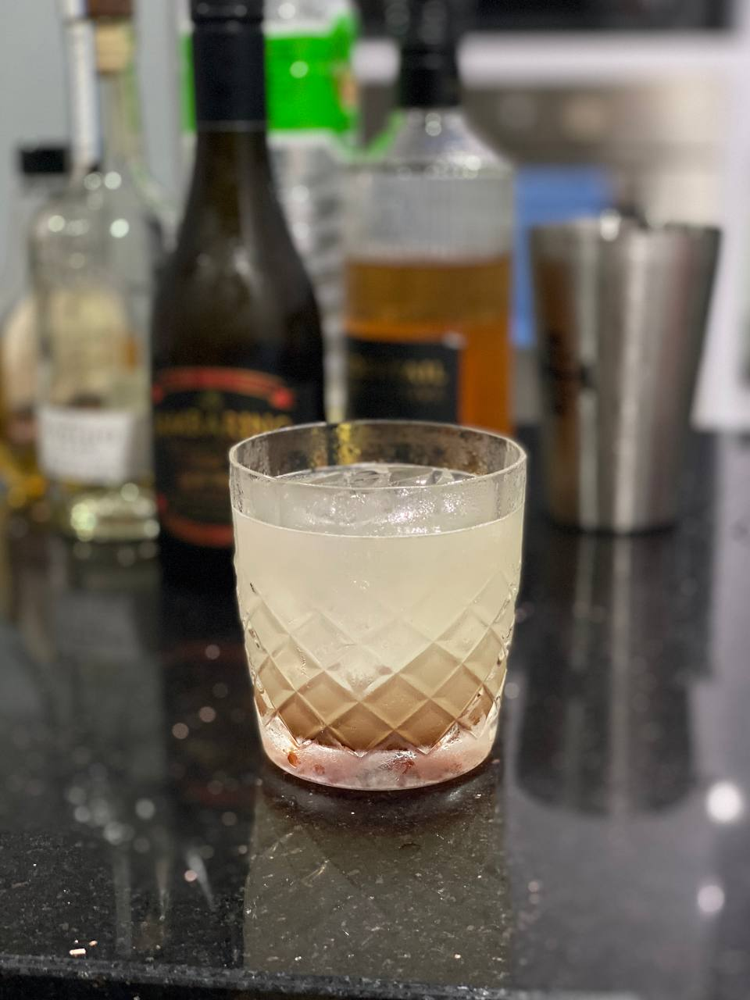

**Method:** Shaken

- **60 ml** blanco
- **30 ml** Kalamansi
- **10 ml** butterscotch Schnapps
- **5 ml** agave nectar
- **5 ml** drizzled chocolate Liqueur

*Method.* shaken

> Seems too sour (but using fresh lime juice instead of Kalamansi could work out better)

`agave`  `to-try`  `coffee/dessert`

### Butterscotch Mezcal Mule

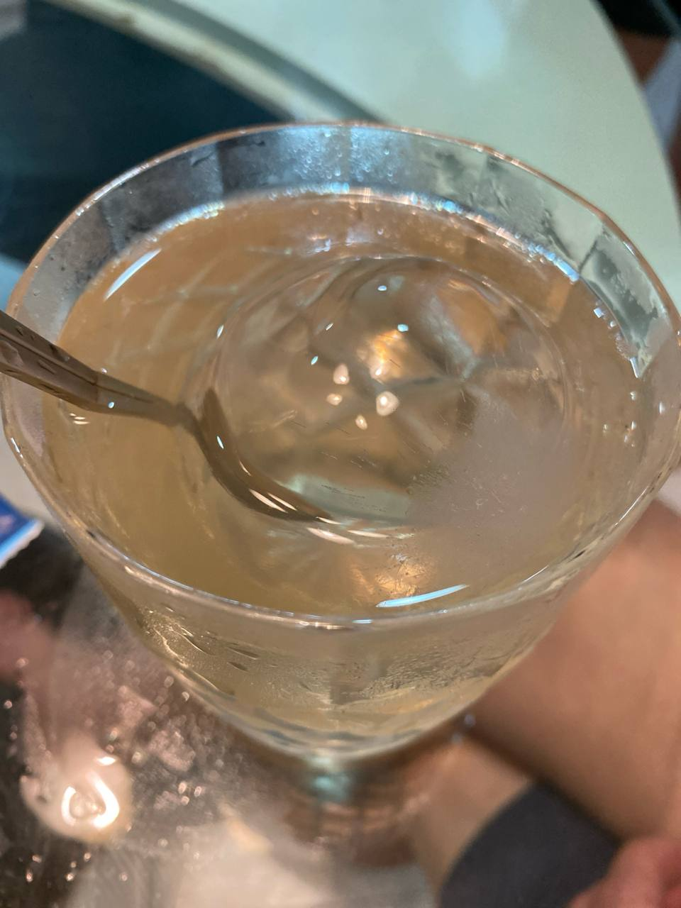

- **45 ml** Ancestral
- **75 ml** Ginger beer

> Dad: spice fills the mouth, beyond the spiciness is sweet, is nice · Mike: easy way to enjoy Mezcal, kinda like whiskey sour is a gateway whiskey

`agave`

### Desert B52

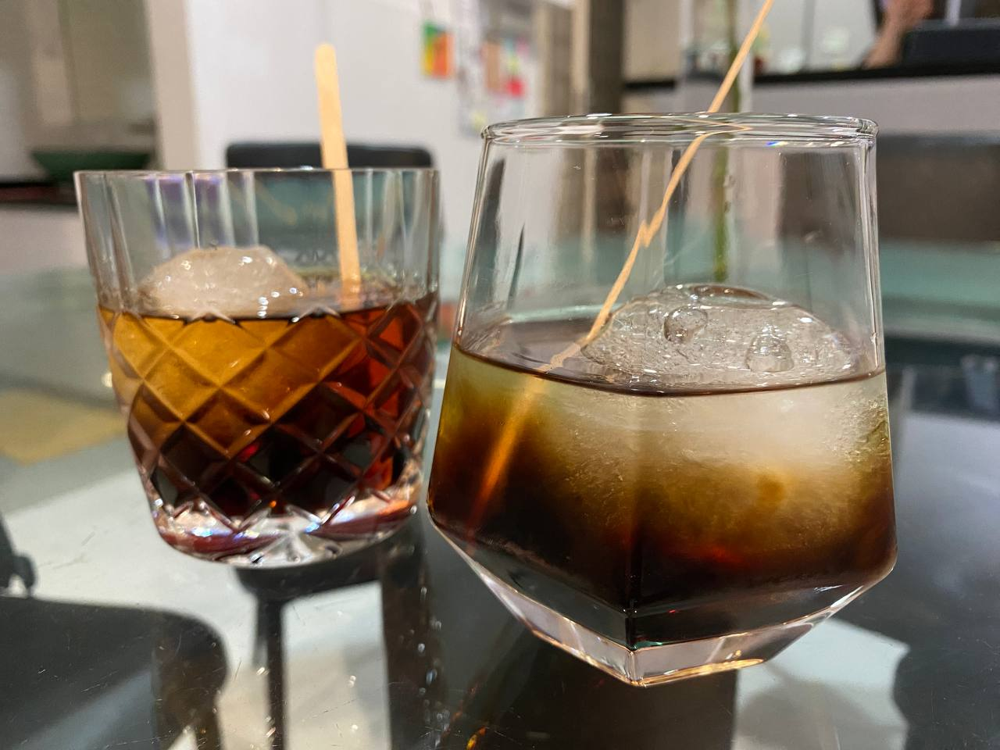

- **30 ml** chroma lab trip sec
- **30 ml** kahlua
- **30 ml** Código blanco

*Method.* poured over cloudy round ice

> tastes like orange chocolate. Nice!

`agave`  `coffee/dessert`

### Gold Rush

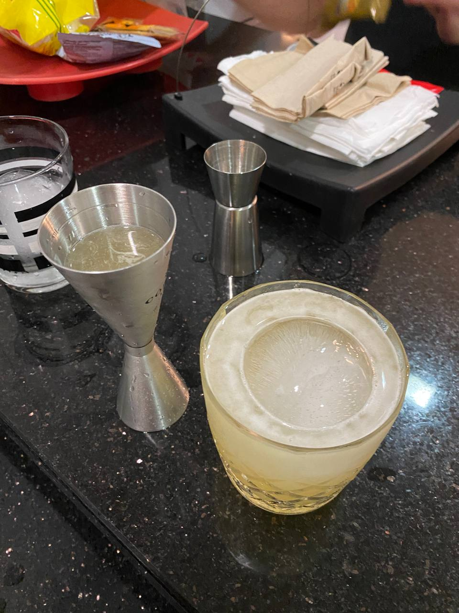

- **0.5** Honey
- **2** bourbon/whiskey
- **0.5** Water
- **0.75** lemon
- Splash of gold powder
- (Tested 27 Jun)
- used old drambuie
- good sweetness

*Method.* use clear glass to see sparkle

> used agave (can use less - 10ml?)

`agave`  `tested`

### Kefir Lime Margarita

- Tried by muddling
- **0.5 oz** chilli agave
- **1 oz** Kefir Lime juice
- **2** mint
- Half new Zealand apple, diced
- **2** Blanco
- Tequila flavour really comes forward

`agave`  `tested`  `spicy`

### Mango Kentucky Buck

**Method:** Muddled & shaken

- **4** cubes of mango, muddled
- **0.75 oz** Lemon Juice
- 1/3 - 1/2oz Agave Nectar
- **2 dash** Angostura
- **2 oz** Buffalo Trace Bourbon
- Hardshaken and doublestrained over a spear
- Topped up with Ginger Beer (1-2oz)

> Sweet profile but surprisingly multidimensional. Some trace smoke from the bourbon and angostura. Body of a light whiskeysour.

`agave`  `tropical`

### Master Margarita (clarifiable Base)

**Method:** Muddled & shaken

- **45 ml** Teq
- **30 ml** Cointreau
- **30 ml** Lime juice (muddled with fruit)
- fruits+fruit syrup
- All can be clarified

`agave`  `batch`

### Max’s Margarita

- **20 ml** agave
- **10 ml** 4:1 saline or pinch salt
- **30 ml** lime
- **45 ml** blanco

`agave`

### Pistachio Carajillo

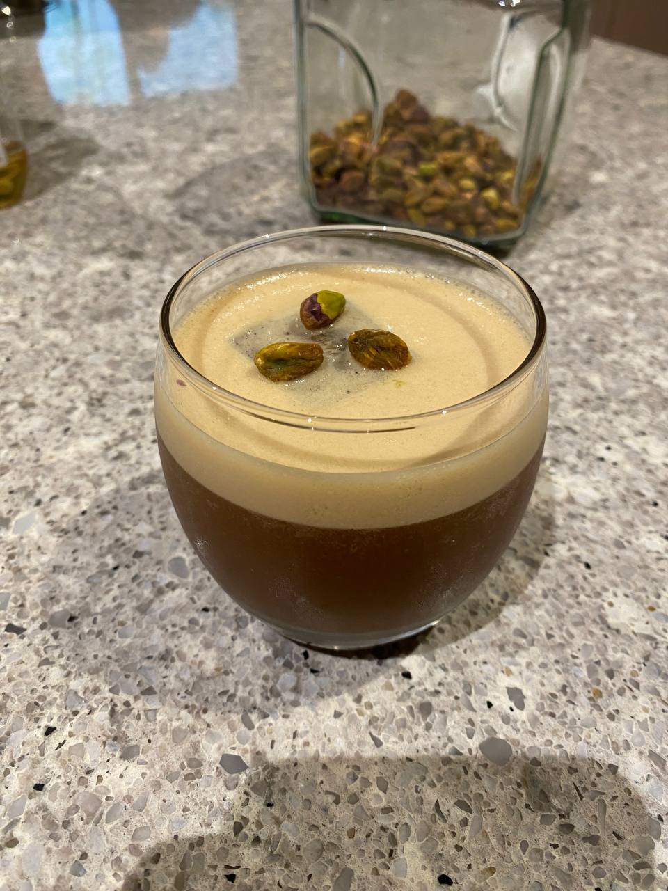

**Method:** Shaken

- **2** Blanco
- **1** Espresso
- **1** Espresso Martini Mix
- **0.5** Bottega Pistachio
- **0.25** Agave

*Method.* shaken & top with pistachios on rock

> NOTES: pistachio flavour not strong. Add more pistach liqueur (try 1oz) or crush pistachio before shaking. Can try without espresso martini mix. Presentation: dip rim into nectar and roll over crushed Pistachio

`agave`  `coffee/dessert`

### Triple S (Spicy Smoky Strawberry) Paloma

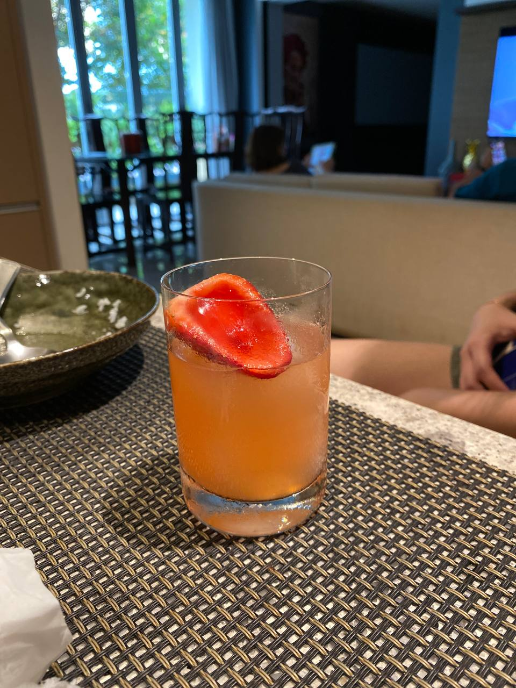

**Method:** Muddled & shaken

- **3** strawberries, quartered
- **0.5** Lime Juice
- **2** fresh GrapefruitJ
- **0.5** agave / Spicy agave
- **2** Tequila/Mezcal
- **2 drops** saline
- **3/4** ice
- **1 cup** boiling water
- **1 cup** tequila
- 1pack Jell-O
- Feedback:

*Method.* Muddle (in shaker). Into highball glass (little round ice). Top with sparkling water (can use more cucumber seltzer). Presentation: Chocolate-covered strawberry with a chilli slice balanced like a halo

> Try: Strawberry Jello shots? · Nice! Can add to Saturday signature shakes · no need to add mezcal. Too many textures as-is · can try mixing in a milky drink like Calpis or Yakult · very little Lime Dash water used (maybe 30ml?)

`agave`  `spicy`  `coffee/dessert`

### · Gin ·

### Blue Lady

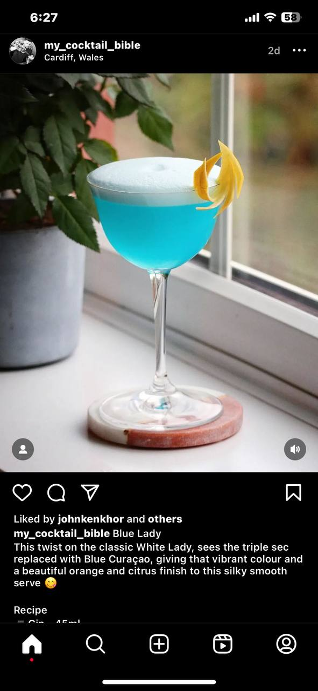

- **1.5** Gin
- **0.75** Blue Curac
- **1** Lemon
- **0.25** Simple
- Egg white
- **3 dash** orange bitters
- Lemon Peel Garnish
- **2** Gin
- **1** BlueC
- **1** Lemon
- Eggwhite
- <Tested>

> [source: instagram.com]

`gin`  `tested`

### Dumbledore Juice (Butterfly Pea Gin)

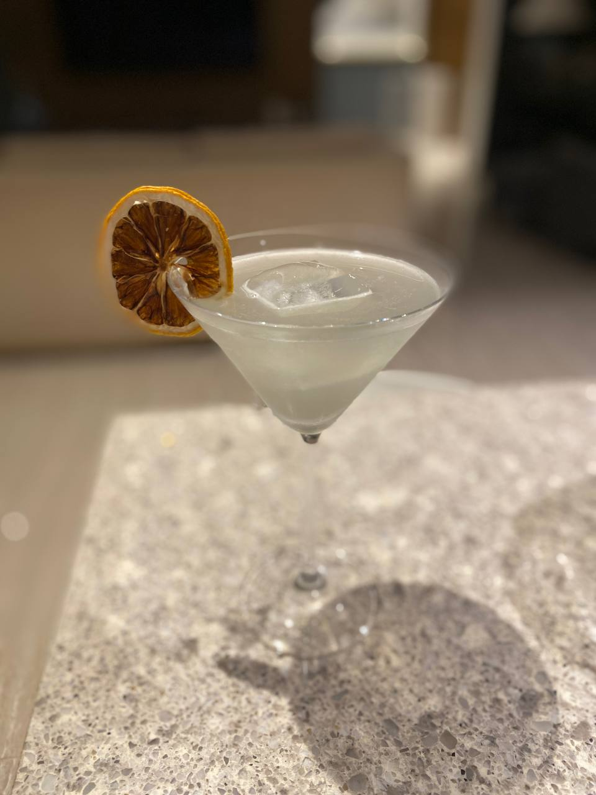

*Method.* used Roku Sakura. 10 dried BPF. 105ml water. Add sparkles for the magical vibe

> Tasty and balanced! Use more of a floral gin (1.25oz to 0.75 everything else is good) · TO TEST: make butterfly pea square ice cube to see if colour leeches into drink

`gin`  `to-try`

### Guava Aperol Gin

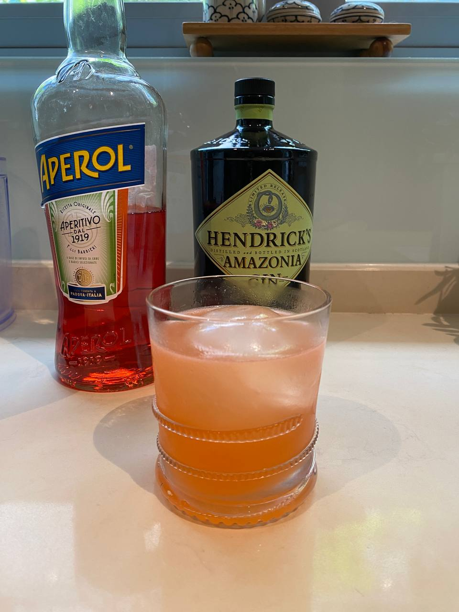

- **0.15 oz** Kefir Lime J (amount in one small lime)
- **0.5** Agave
- **0.7** Aperol
- **1.5** Grapefruit J
- **1.5** Hendricks Amazonia Gin

> Very distinct flavours (kefir, Aperol, grapefruit) that comes out at different times with each sip · Can use a tiny bit more kefir but not so much that it overpowers the other tastes

`agave`  `tested`

### · Whisk(e)y ·

### Jameson Highball

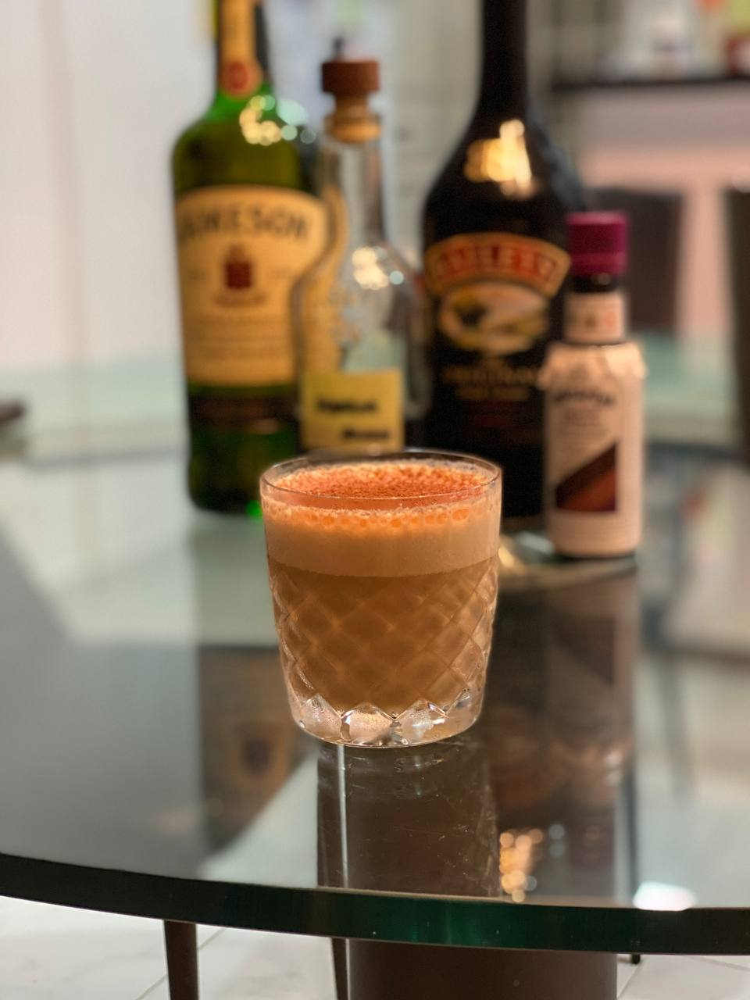

**Method:** Shaken

- Kahlua 22.5ml
- Baileys 22.5ml
- Cocoa bitters 3dash
- Whole egg
- Hard shaken
- Cocoa powder garnish
- Nice! Great dessert drink

`whiskey`  `coffee/dessert`

### Mikes Whiskey Sour

- 60 whiskey
- 20 lemon
- **15** syrup
- **30 ml** 1 Egg white

`whiskey`

### · Rum, Cachaça & Cane ·

### Cafe Di Venezuela

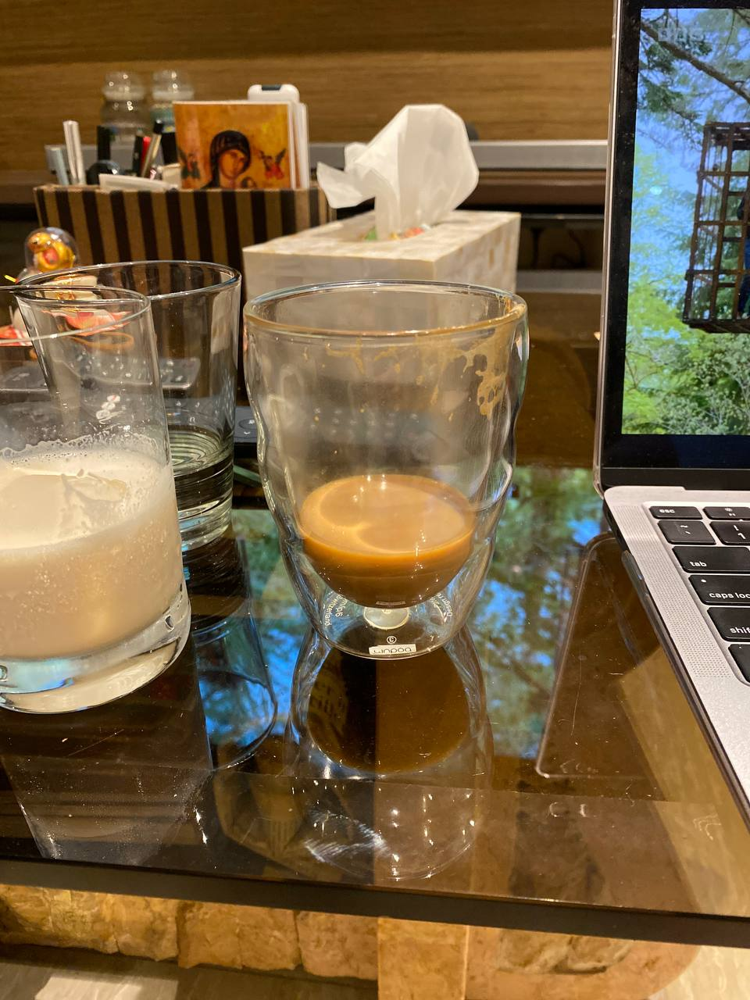

- **60 ml** Espresso
- **30 ml** Diplomatico rum
- **30 ml** Kahlua
- **100 ml** Meiji Chocolate Milk
- warm and fantastic boozy balance

*Method.* Steam milk and alcohols then add like regular milk

> fantastic! Works the best hot chocolate-like drink · to try adding 30ml of Baileys next time

`rum`  `to-try`  `coffee/dessert`

### Coconut Fiesta

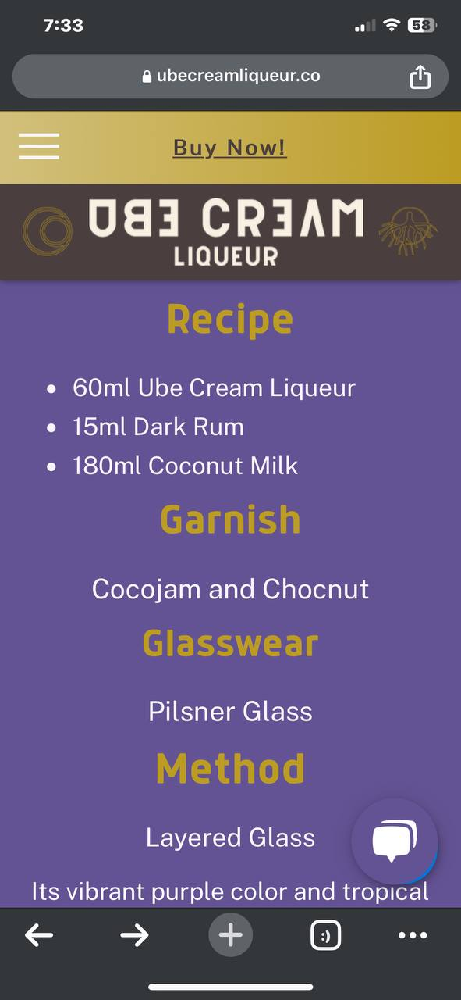

**Method:** Shaken

*Method.* 2oz ube cream. 0.5 rum. 6oz coconut milk. 40ml ube. 10ml Diplomatico Exclusiva Reserva. 90ml coconut cream. 30ml water (to make coconut milk)

> Tested: · “This cocktail is really growing on me” · could be less thick (Shake longer is ok) · consider coconut bowl presentation (double portion) and top with tropical decor like flowers and umbrella. · tried to line with twist of coconut but when the glass is poured it disappears · consider sections: creamy, foamy, fruit based, tropical, colours, thick, Asian flavours [source: ubecreamliqueur.co]

`rum`  `tested`  `to-try`  `tropical`

### Double D Old Fashioned

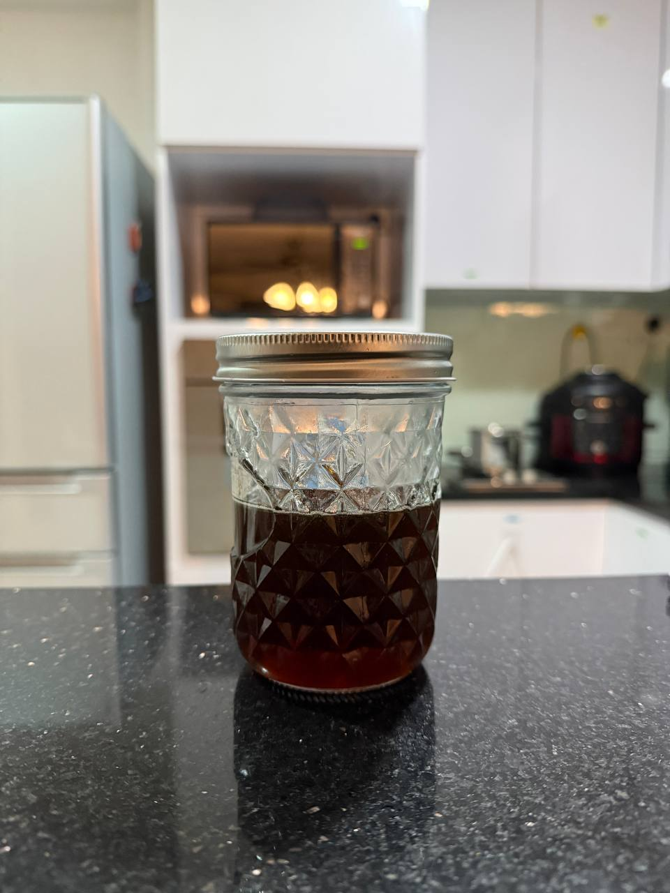

**Method:** Stirred

- 60 Diplomatico Dark Rum
- **7.5** Rich Demerara Cinnamon Syrup
- **2 dash** Angostura Bitters

*Method.* stirred and strain over big ice

> orange zest over ice (nose notes) and discard · Sa likes!

`rum`

### Malibu Cream Dream

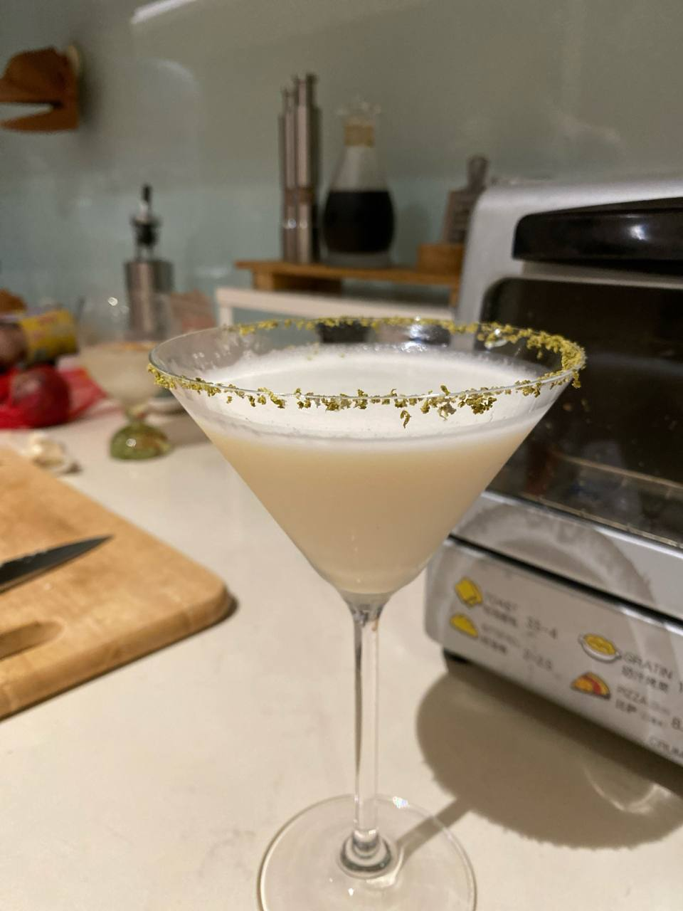

- **30 ml** Malibu
- **30 ml** Elyx
- **15 ml** condensed milk
- **5 ml** vanilla essence

*Method.* Use Biscoff rim over agave next time

> Dehydrated (fridge) lime zest rim over lime juice

`rum`  `tropical`

### · Vodka ·

### Elyx Blue Lagoon (experiment)

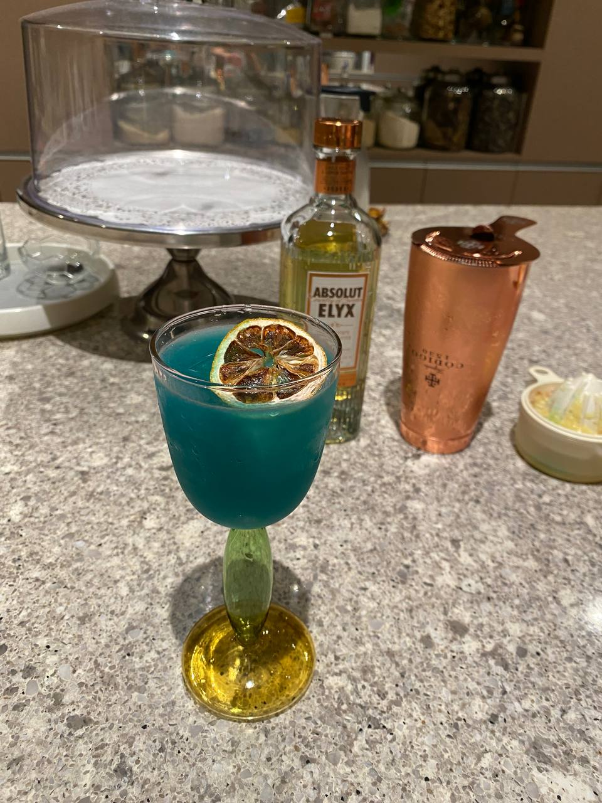

**Method:** Blended

- **1.5 oz** Elyx
- **0.5 oz** Lemon
- **1 oz** unflavoured Simple
- **1 oz** Blue Curac

> After ice melts and dilutes the drink, flavours come together nicely · Try: · Try muddling basil/mint?

`vodka`

### Fromage En Soie - Chocolate Blue Cheese Gimlet

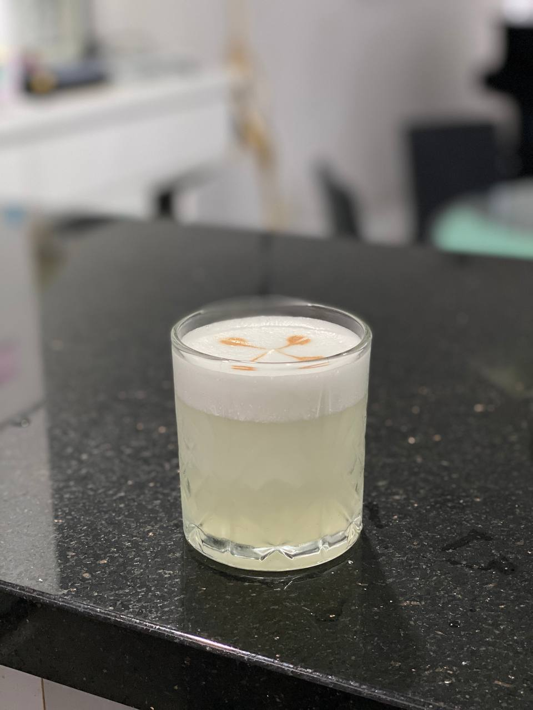

- 60 Blue Cheese Elyx Milkpunch
- 20 Lime
- **15** Trip Sec (revised to 10)
- **10** Rosemary Simple (revised to 15)
- Garnished with 4 drops chocolate bitters

> HONESTLY PRETTY GOOD?!??? it’s like a sweet and savory snack, like a cheese board. Nose of chocolate and sweets, foam like an alcoholic cheese foam. There’s base citrusy notes, and overtone of cheese that’s not overpowering and doesn’t linger on the palate. · Increase rosemary and reduce Cointreau for balance

`vodka`  `batch`  `coffee/dessert`

### Limonada Elyx (Creamy Dreamy Lemonade)

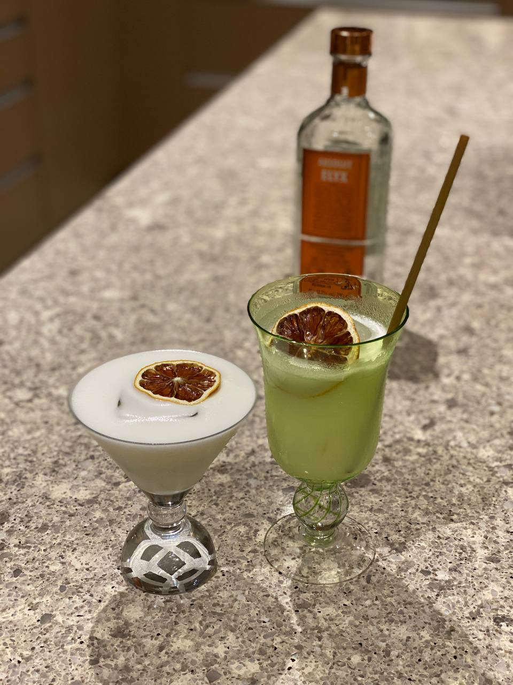

- **1 oz** Lemon
- **0.5 oz** sugar
- **0.5 oz** Condensed Milk
- **2.25 oz** Absolut Elyx
- Without the sugar

> Trial 1: · Trial 2: · Trial 1: Tastes like yakult · Trial 2: frothy texture from shaking makes a beautiful foam rim, but you can’t really see it cause the whole drink is milky. Sweet treat on a hot day. Can be batch made for a party for sure. · Trial 3: 30ml Lemon, 20ml condensed, 70ml Elyx. Still fantastic

`vodka`  `tested`  `batch`

### Saturday’s Pavlova Vodka Gimlet

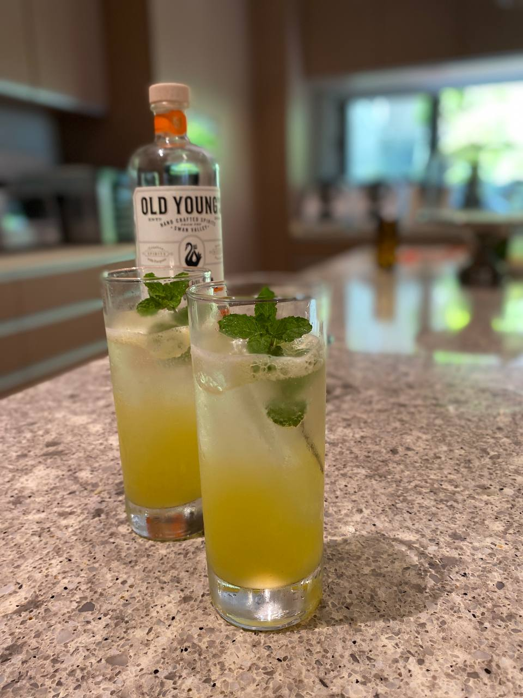

**Method:** Shaken

- **0.75** LemonJ
- **1** Passionfruit Simple Syrup (1:1:1)
- **2** Pavlova Vodka (Old Young from Perth TR)
- **4** clapped mint leaves (for two portions)

*Method.* shaken. top with Lime Dash water. garnish with mint sprig

> First sip really tastes like passion fruit pavlova - afterwards tastes a bit like cough syrup? Not sure if that’s the vodka taste. · Can add Swiss meringue swirl as topping for presentation ◡̈

`vodka`  `tropical`

### · Brandy, Pisco & Grappa ·

### Elderflower Sidecar

**Method:** Shaken  ·  **Glass:** Coupe

- **1 oz** Bourbon
- **1 oz** Cognac
- **0.5 oz** Elderflower Liqueur
- **0.75 oz** Lemon Juice

*Method.* Hard shake and double strain.

> A bourbon-and-cognac Sidecar lifted with elderflower.

`brandy`  `tested`

### · Liqueurs, Coffee & Other ·

### Old Fashioned

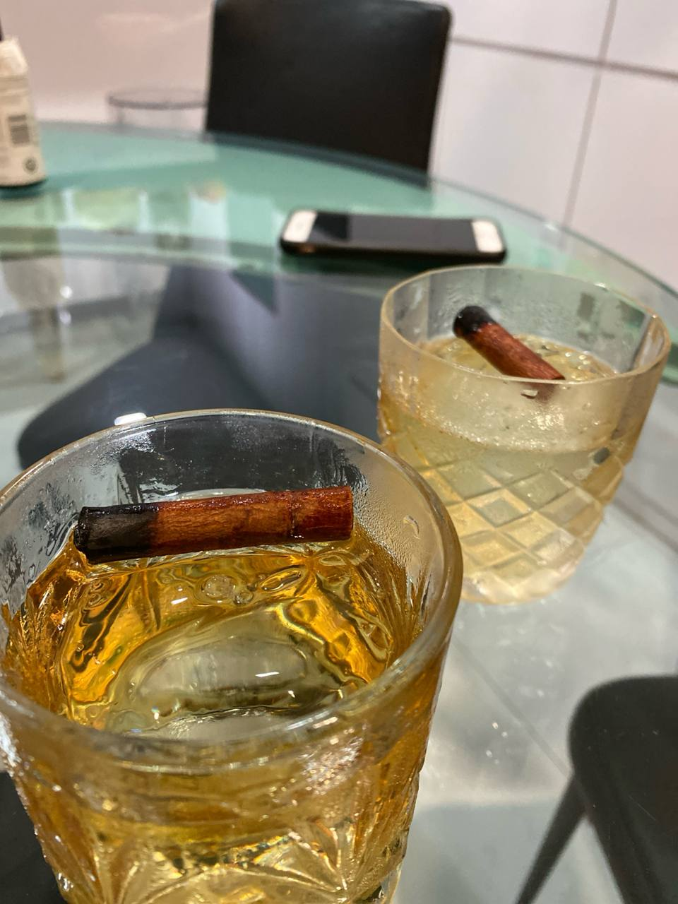

**Method:** Stirred

- **1.5** Woodford Reserve
- **0.25** R.SS
- **2 dash** angostura
- burnt cinnamon stick

*Method.* stirred

> Can be done without burning. Doesn’t add much value [source: R.SS]

`other`

---

## 💡 Inspirations — To Try  (56)

*Saved recipes and ideas, not yet made.*

### · Agave — Tequila & Mezcal ·

### Baby Turtle

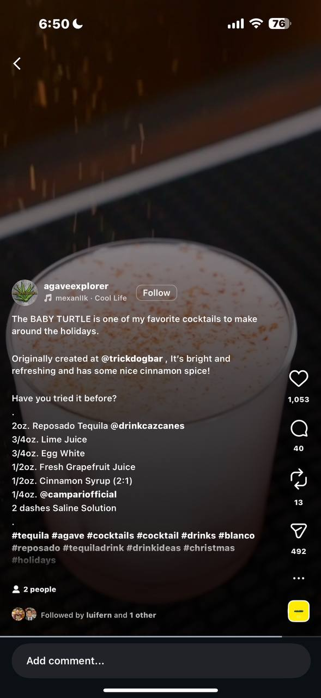

**Method:** Shaken

- **2** Tequila
- **0.25** Campari
- **0.75** lime
- **0.5** grapefruit
- **0.5** r. cinnamon S
- eggwhite
- **2 dash** saline

*Method.* dry shake. wet shake. cinnamon garnish

> [source: instagram.com]

`agave`

### Blue Bear Margarita

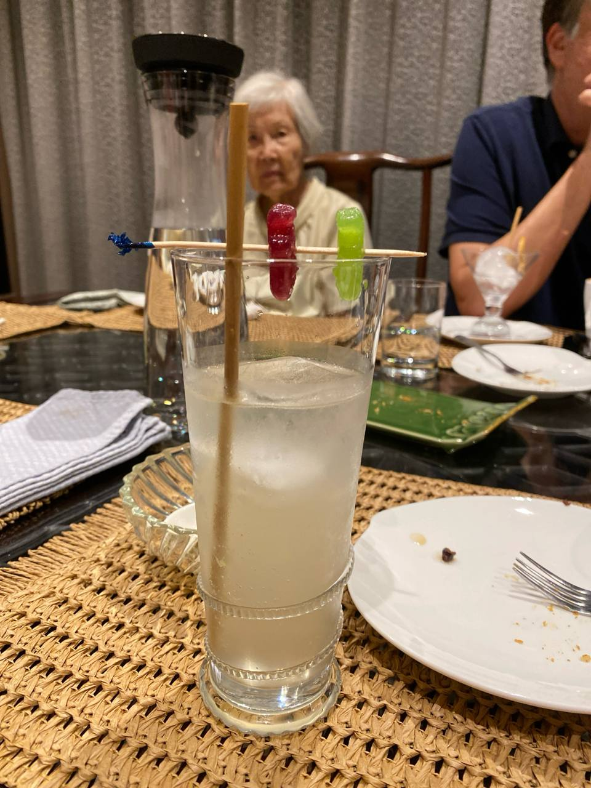

- **45 ml** Elyx
- **45 ml** Peach Schnapps
- **10 ml** lemon J
- **5 ml** Cinnamon Simple
- Dominant agave taste

*Method.* Use a dab of Blue curaçao to make it blue. Float bear using gummy ring or painted Meringue

> To make it more sour we can use lime instead

`agave`  `to-try`

### Blue Velvet

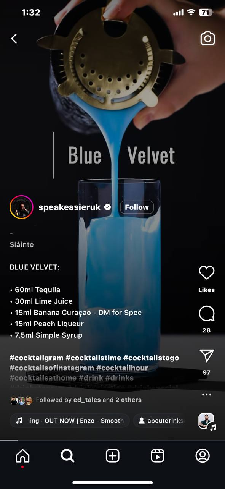

- **2 oz** Teq
- **1** Lime
- **0.5** banana Curac?
- **0.5** peach liqueur
- **0.25** Simple

> [source: instagram.com]

`agave`

### BRAZILLIAN Lemonade (can Be Spiked With Vodka/tequila)

**Method:** Blended

- **3** limes, quartered
- cup of condensed milk
- **2 cups** cold water
- **2 cups** ice

*Method.* blend. finestrain. spike. served over ice like a punch. might be bitter. To test

> [source: instagram.com]

`agave`  `to-try`  `batch`

### Buttered Paloma

**Method:** Stirred

- **2** tequila
- **2.5** grapefruitJ
- **0.5** lime
- **0.5** simple
- 3-4 drops saline
- topped with soda water

*Method.* fatwash 1:5 browned butter to (repo) tequila. stirred in highball glass with crushed ice. garnish with grapefruit wedge (buttered and baked like a toast?)

> [source: instagram.com]

`agave`

### Chilli Cucumber Mojito

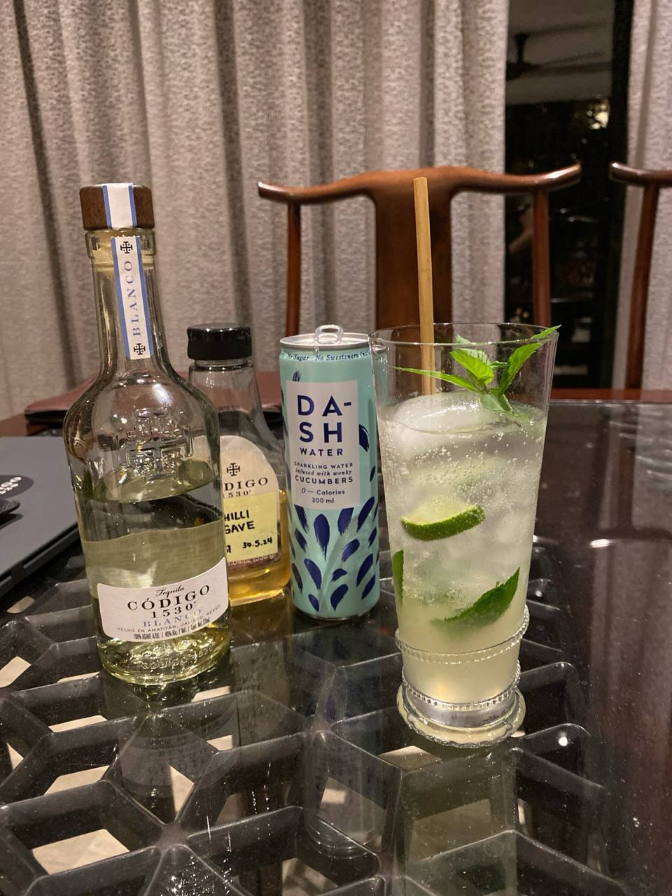

**Method:** Stirred

- **7** mint leaves
- **2** quarter-wedges of lime
- **2/3** chilli agave
- **2.5 oz** cucumber dash

*Method.* way too strong chilli if not stirred. mint and cucumber come together to make the mojito vibe. chilli adds surprising kick after refreshing front taste. beach drink

`agave`  `to-try`  `spicy`

### Choco Caliente

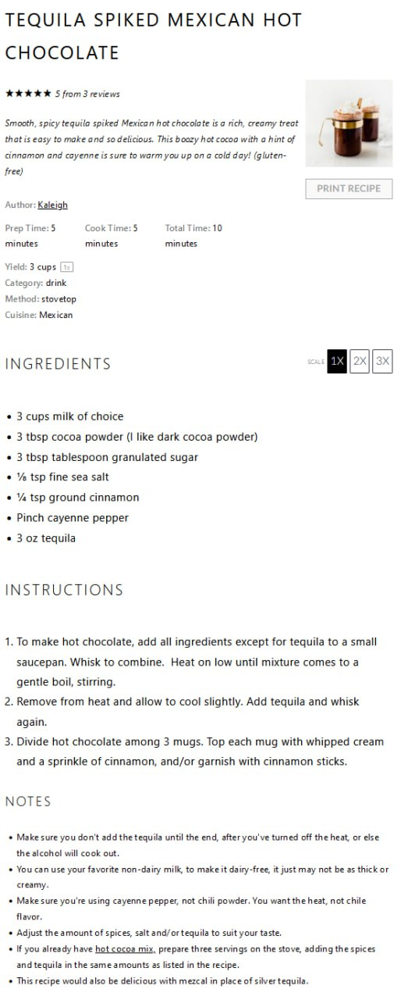

**Method:** Stirred

- **700 ml** 3cup milk
- **37.5 ml** 1.25oz Cinnamon Simple Syrup
- **37.5 g** <Replaced> 3tbsp sugar
- **1.5 g** <Replaced> 0.25tsp ground cinnamon
- **3 tbsp** cocoa/hotchoc
- **0.75 g** 0.125tsp salt
- **90 ml** 3oz Blanco/Mezcal

*Method.* Add all except tequila in saucepan. Whisk. Stir while heating on low until gentle boil. Remove and cool slightly (so alcohol doesnt boil out). Whisk. Serve and garnish with whipped cream and sprinkled cinnamon

> Makes 3 cups: [source: livelytable.com]

`agave`  `batch`  `coffee/dessert`

### Cupid's Jungle Juice

**Method:** Stirred

- chopped strawberries
- 1L Vodka
- **2 cup** Blanco
- **1 cup** strawberry juice
- **48 oz** strawberry seltzer
- **52 oz** 0-sugar lemonade
- 1.5l lemon Sprite

*Method.* Stir with ice

> [source: instagram.com]

`agave`  `batch`  `non-alcoholic`

### Devils Margarita

**Method:** Shaken

- **50 ml** Tequila
- **25 ml** Lime juice
- **12.5 ml** Agave Nectar
- Lime juice to salt rim (optional)

*Method.* Shake with ice. Add to iced glass. Layer red wine. Garnish lime wheel. Add on: Cointreau

> Grenadine to make a tequila sunset instead of wine [source: instagram.com]

`agave`  `to-try`

### Espresso Tequila Batch

**Method:** Shaken

- **1 cup** espresso
- **0.25 cup** Agave
- **0.25 cup** Kahlua/Baileys
- TO TEST BEFORE BATCH MAKING

*Method.* store in freezer. shake and grate cinnamon to serve

`agave`  `to-try`  `batch`  `coffee/dessert`

### Freezerdoor Cinnamon Roll Espresso Martini

**Method:** Built

- **500 ml** Tequila/Elyx
- **250 ml** Espresso
- **125 ml** Kahlua
- **125 ml** Baileys
- **3** cinnamon sticks
- **1 tbsp** Powder a sugar
- **1 tsp** ground cinnamon
- **0.5 cup** heavy cream

*Method.* Top with. whisk and spoon over. drizzle cinnamon swirl

> [source: instagram.com]

`agave`  `coffee/dessert`

### Fuego

- (TO TEST)
- Tequila 60ml
- Apple juice 45ml
- Lime juice 15ml
- (Agave + Tobasco / Chilli)

`agave`  `to-try`  `spicy`

### Instant Espresso Martini

- **2 tsp** instant espresso
- **2 tsp** sugar
- **15 ml** hot water
- **15 ml** tequila/vodka

*Method.* add some ice for chill and dilution. whisk well with hand foamed. finestrain over ice/into chilled glass

> [source: instagram.com]

`agave`  `coffee/dessert`

### Kiwi Mint Tequila

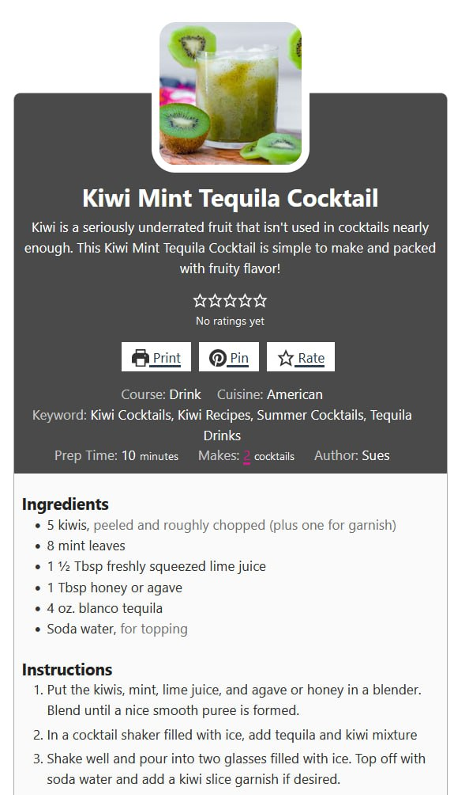

**Method:** Built

- **5** Kiwi
- **8** Mint Leaves
- **1 oz** Lime
- **0.75 oz** Tbsp Agave
- **4** Blanco

*Method.* Top with Soda Water. Garnish with Kiwi Slice

> [source: wearenotmartha.com]

`agave`

### Long Island Spiced Tea

**Method:** Stirred

- Long Island Spiced Tea
- **0.75** Ginger-smth
- **0.75** Lemon Juice
- **0.75** Tequila
- **0.75** Gin
- **0.75** Spiced rum
- **0.75** Vodka

*Method.* stir to chill. Top with coke. Garnish with lemon wedge

> trial without coke and swapped ginger liquer for 1.5oz Gingen (Brown Sugar, half mug) [source: instagram.com]

`agave`

### Los Altos

- **1.5 oz** Blanco Tequila
- **0.5 oz** Mezcal
- **1.5 oz** Pineapple Juice
- **0.5 oz** Lime Juice
- **0.5 oz** Simple Syrup

> [source: instagram.com]

`agave`  `tropical`

### Matchajillo

**Method:** Shaken

- **2 tsp** Matcha
- 30 hot water
- 45 Licor43
- 22.5 Heavy cream
- Egg white

*Method.* dry shake. wet shake

> 30 blanco (proportion not specified so maybe 45/60) [source: instagram.com]

`agave`  `coffee/dessert`

### Oaxaca Old Fashioned (death & Co)

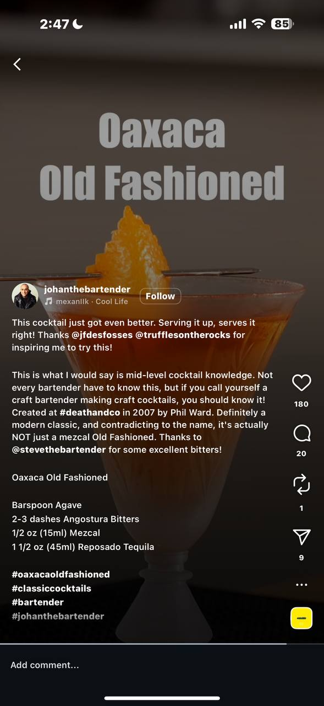

**Method:** Stirred

- **5 ml** (barspoon) agave
- **2 dash** (4 if bitter bottle) bitters
- **15** mezcal
- 45 reposado

*Method.* stirred to fully chill & dilute. served up

> [source: instagram.com]

`agave`

### Proper Carajillo

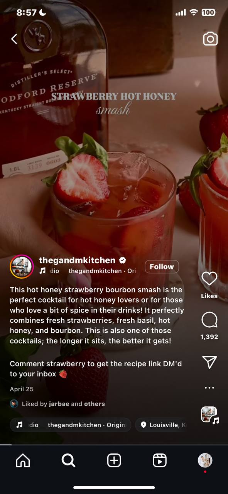

**Method:** Shaken

- 45 espresso
- 30 blanco tequila
- 30 licor43
- Pinch salt

> Double shake and serve over block ice [source: instagram.com]

`agave`  `coffee/dessert`

### Quick Builds (3 Minis)

**Method:** Stirred

- **10** Tommy's Margarita: Tequila (45) + Lime (20) + Agave
- SHOT:
- Holiday drinks:

> Kalimotxo: Coke (1) + Wine (1), stirred · Thompson Margarita: Tequila (45) + Lime (20) + Chilli Agave (15) > Chilli Water (rtp soak 12g + 45ml for 10min) + 135g agave · Baby Guinness: Kahlua (3) + Baileys (1), layered [source: blog.haskells.com]

`agave`  `spicy`  `festive`  `coffee/dessert`

### Raspberry Malibu Margarita

- Raspberries
- **7.5 ml** Agave
- **25 ml** Malibu
- **25 ml** Lime
- **50 ml** Tequila blanco

`agave`  `to-try`  `tropical`

### Red Grasshopper

**Method:** Built

- **0.75 oz** Honey Syrup
- **1 oz** Lime Juice
- **2 oz** (Still Str if possible) Tequila

*Method.* Top with Paprika

> [source: instagram.com]

`agave`  `spicy`

### Rosemary Paloma Sour

**Method:** Shaken

- Rosemary Paloma Sour
- **2 oz** Tequila
- **1 oz** lemon or lime juice (I know Paloma's typically have lime juice but I prefer lemon in a sour)
- **1/2 oz** Rosemary Simple Syrup (leftover from my
- Midnight Margaritas)
- **1** egg white (I use 1 oz of pasteurized liquid egg whites)
- **3/4 oz** fresh squeeze grapefruit juice
- **3 drops** of Angostura bitters
- Rosemary sprig for garnish

> First pop your coupe or Nick and Nora glass in the freezer to chill. In a cocktail shaker, add your tequila, lemon juice, grapefruit juice, simple syrup, salt and egg whites. Shake first without ice (dry shake). Next add ice and shake again (wet shake). Grab your chilled glass and double strain in your cocktail. Top with 3 drops of Angostura bitters and a sprig of rosemary. · Carefully add a flame to the end of the rosemary sprig for a little smoke. Best enjoyed in your comfy cozies curled up ne… [source: instagram.com]

`agave`

### Rum N Cola

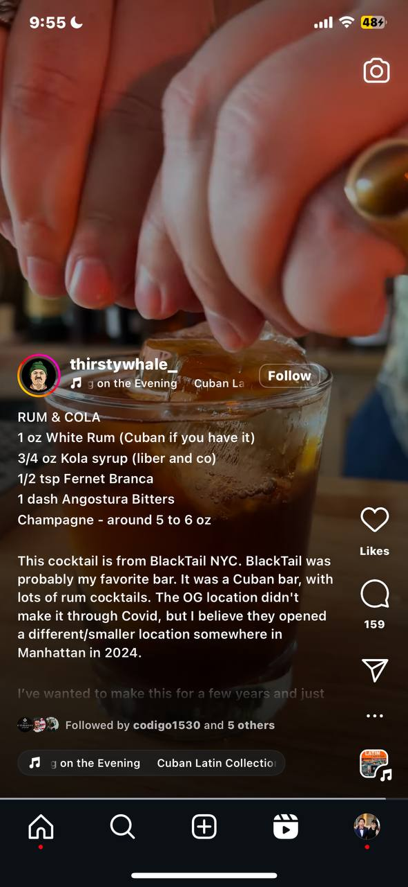

**Method:** Stirred

- 30 blanco rum
- 120 coke or
- 22.5 cola syrup + 120 sparkling
- **1 dash** Angostura
- **2 drops** saline
- (Optional) 2.5 fernet Blanca
- Stirred and topped

*Method.* lemon peel spritz

> [source: instagram.com]

`agave`

### Spicy Apple Cider Margarita

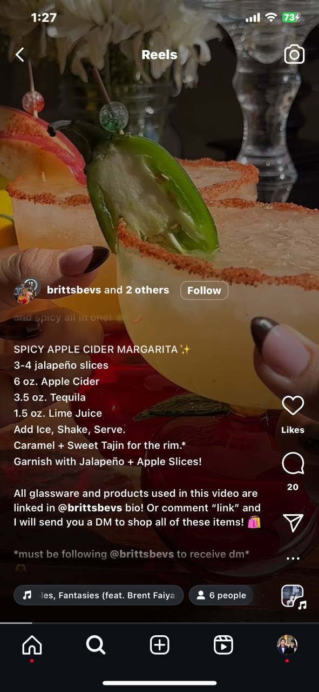

**Method:** Muddled & shaken

- **6 oz** Apple cider
- **3.5** Blanco
- **1.5** LimeJ

*Method.* Muddle. Caramel + Sweet Tajin rim (to get tajin and rimming plate). Shake & strain over small ice

> apple slice? [source: instagram.com]

`agave`  `spicy`

### Spicy Pineapple Tequila Sour

**Method:** Shaken

- **0.5 oz** Chilli Agave/Simple
- **1 oz** Lime
- **1 oz** Pineapple
- **2 oz** Teq Blanco
- Eggwhite

*Method.* Dry shake. Shake with ice. Doublestrain

> [source: instagram.com]

`agave`  `spicy`  `tropical`

### Tequila East Side

**Method:** Muddled & shaken

- **3** cucumber slices
- **8** mint leaves
- <Muddle>
- **0.75 oz** Simple Syrup
- **1 oz** Lime
- **1.5 oz** Blanco
- <Shake w ice & double strain>

> [source: instagram.com]

`agave`

### Tequila Martini

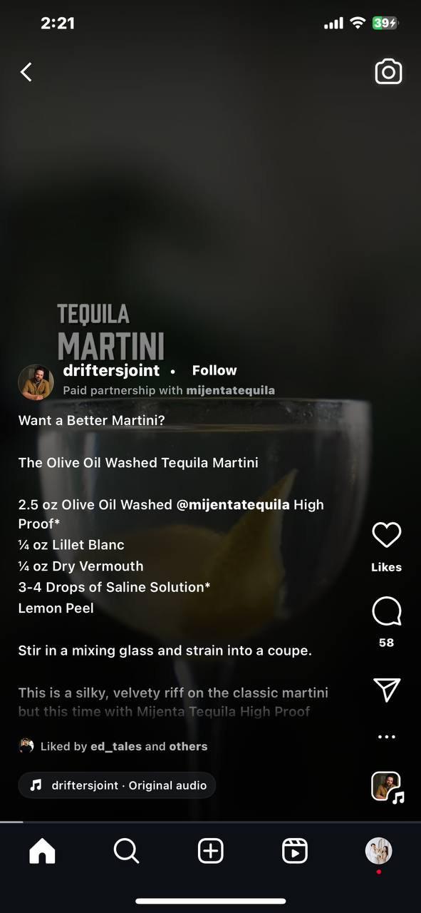

**Method:** Shaken

- 1:5 Olive Oil:Tequila (fat washed)
- seal, shake, sit, freeze
- **2.5** Olive Oil Tequila
- **0.25** Sweet vermouth
- **0.25** lillet blanc
- 3-4drops saline

*Method.* stirred. garnish with lemon peel

> [source: instagram.com]

`agave`

### Tequila Mojito

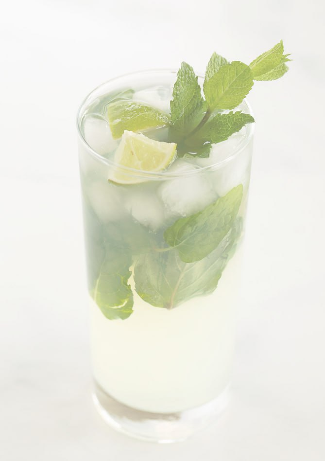

**Method:** Muddled & shaken

- **1/2** lime
- **5** mint leaves
- **1.5 oz** teq
- **2 tbsp** simple
- soda topup

*Method.* Muddle lime, mint. Fill with ice. Add teq. add simple. Topup with soda

> [source: julieblanner.com]

`agave`

### Tequila Old Fashioned

**Method:** Stirred

- **2 dash** Angostura
- **0.25** Agave
- **2** Anejo

*Method.* Stir and serve in same glass

> [source: instagram.com]

`agave`

### Tequila Revolver

**Method:** Stirred

- **1.5** Reposado/Bourbon
- **1.5** Coffee Liqueur / Mr Black
- **3 dash** chocolate bitters
- stirred

*Method.* garnish of choice

> Can add some mint elements to make a grasshopper/after8 twist, like mint liqueur and mint choc garnish [source: instagram.com]

`agave`  `to-try`  `coffee/dessert`

### · Gin ·

### Christmas Song

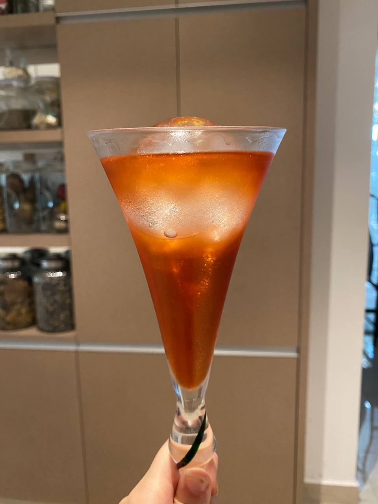

**Method:** Stirred

- **2 oz** cinnamon gin
- **10 ml** chestnut liquer
- **5 ml** cinammon Simple
- **2 dash** angostura

*Method.* gold spritz into tin. stir well and double strain

> chestnut liquer more, cinammon optional, try smoking with Cinnamon or Chestnut shells [source: sipsmith.com]

`gin`  `festive`

### Clarified Jasmine Gin Tea

- Clarified Jasmine Gin Tea
- **2.5 g** Tea leaves
- **60 ml** 3 x Warm Water
- **60 ml** 3 x Milk
- **30 ml** 1.5 x Lemon juice
- **30 ml** 1.5 x lychee purée
- **30 ml** 1.5 x simple syrup
- **90 ml** 4.5 x gin
- **3.5** oz/portion
- Recipe makes ~250ml

> [source: instagram.com]

`gin`  `batch`

### Clover Club

- **60 ml** Gin
- **5** raspberries
- **15** vanilla syrup
- 30 lemon juice
- Egg white
- Raspberries garnish

> [source: instagram.com]

`gin`

### Coriander Dance

**Method:** Stirred

- **45 ml** Gin
- **15 ml** LemonJ
- **15 ml** Peppermint
- **25 ml** Prosecco/Sparkling

*Method.* drizzle champagne glass with simple (not stem). Salt rim. coriander sprinkle to cover rest of flute body. stir and strain into flute over ice. Top with Sparkling

> [source: instagram.com]

`gin`

### Grape Gin Sour

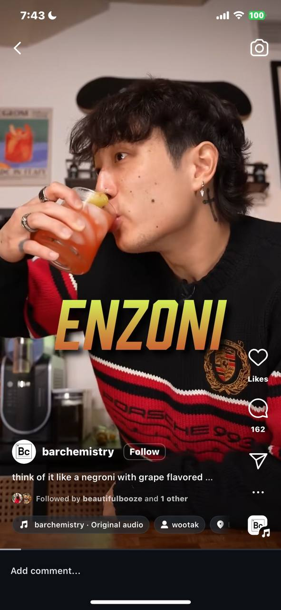

**Method:** Muddled & shaken

- **2 drops** saline
- **0.75** LemonJ
- **0.75** Simple
- **1** Campari/Aperol
- **1** Gin

*Method.* Muddle. Muddle. double strain over ice

> [source: instagram.com]

`gin`

### Jasmine Gin Sour

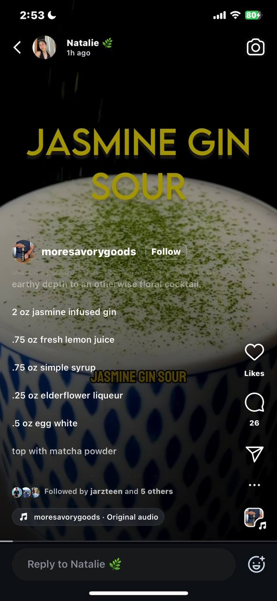

**Method:** Shaken

- 60 Jasmine Gin (20g:1L)
- 22.5 LemonJ
- 22.5 Simple
- **7.5** Elderflower
- **15** Egg white

*Method.* leave to soak for 90min. dry shake. wet shake. top with matcha dust

> [source: instagram.com]

`gin`  `batch`  `coffee/dessert`

### Soapy Ramos (Cilantro Gin)

**Method:** Shaken

- **45 ml** Cilantro Gin
- **30 ml** full cream
- **50 ml** cilantro juice
- **20 ml** syrup
- egg white

*Method.* Shake with spring and large ice. double strain. top slowly with soda water

> [source: instagram.com]

`gin`

### Spice Run

**Method:** Blended

- **6** Basil Leaves
- **0.75 oz** Lemon Juice
- **0.75 oz** Cinnamon Syrup (blend cinnamon stick with 1 cup Simple) {can be more cinnamony}
- **2 oz** Gin

*Method.* Muddle, ice and shake into chilled glass, garnish with basil leaf

> [source: instagram.com]

`gin`

### White Lady

**Method:** Shaken

- **10** Simple syrup
- **30** Lemon juice
- **22.5** Cointreau
- **1** Egg white
- **45** Gin
- V2:
- **1.5** Gin
- **1 tsp** Sugar
- **1** TripSec
- **1.5** Lime
- Egg white
- **0.5** cream?

*Method.* Shake with ice

> [source: instagram.com]

`gin`

### · Whisk(e)y ·

### Japanese Jelly Coffee

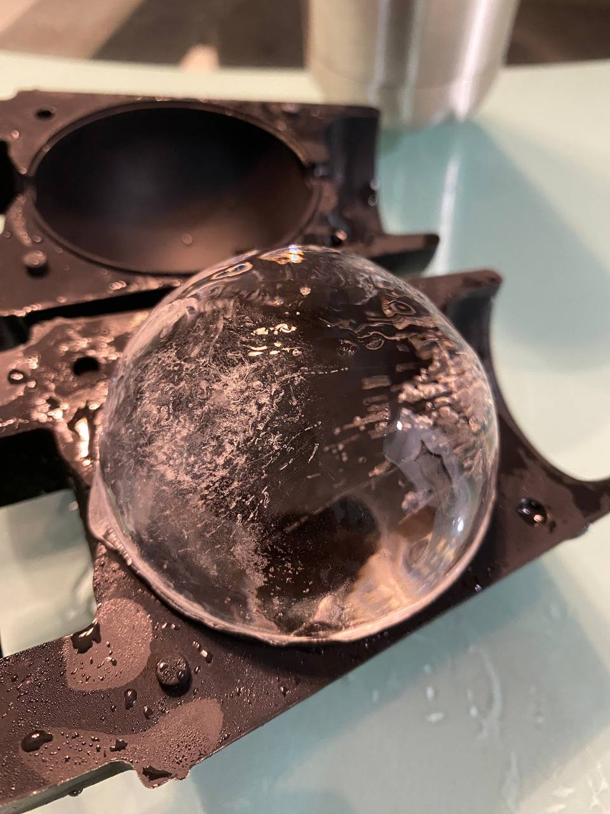

- **2 tbsp** Instant Coffee
- **1/3 cup** Brown Sugar
- **2 tsp** gelatin powder
- **1 cup** Water
- **1 cup** hot water
- milk
- condensed Milk / caramel

*Method.* whisk, pour into cup, fridge. whisk. pour over cold jelly and serve

> [source: instagram.com]

`whiskey`  `coffee/dessert`

### Kentucky Buck

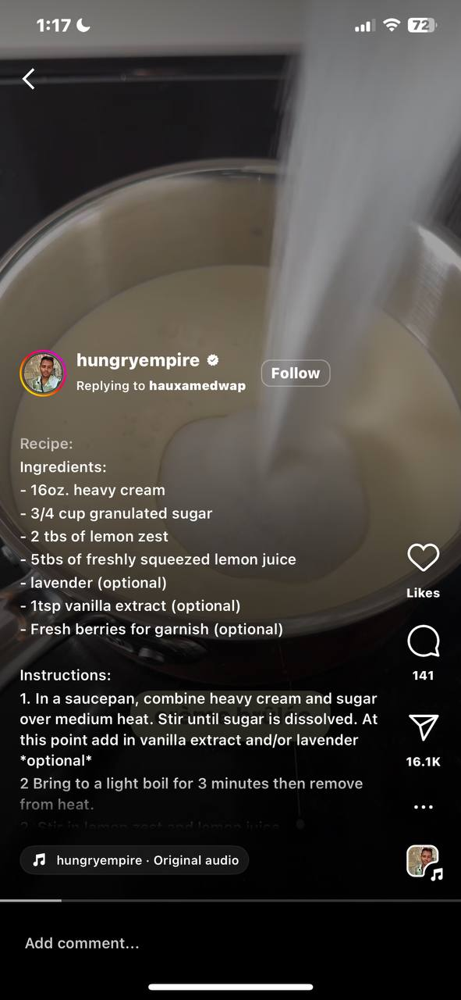

**Method:** Muddled & shaken

- **3/4 oz** lemon juice
- **2 oz** bourbon whiskey
- **1/4 oz** simple syrup
- **2 dash** bitters

*Method.* muddle 2 strawberries. Shake and serve over ice and 3-4oz ginger beer

> [source: instagram.com]

`whiskey`

### Non-alcoholic Basil Matcha Mocktail

**Method:** Muddled & shaken

- **0.5 oz** simple
- ice and top with Tonic water

*Method.* muddle with basil leaves

> matcha (strain powder and whisk with hot water) [source: instagram.com]

`whiskey`  `non-alcoholic`  `coffee/dessert`

### Pineapple Bourbon Sour

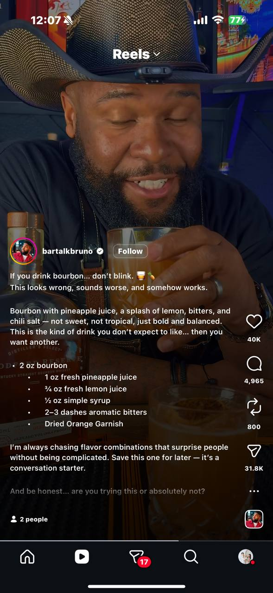

- **2** Bourbon
- **1** PJ
- **0.75** LeJ
- 0.5simple
- **2 dash** bitters
- dehydrated orange slice garnish

> [source: instagram.com]

`whiskey`  `tropical`

### Sweet Cream Vodka Lemonade

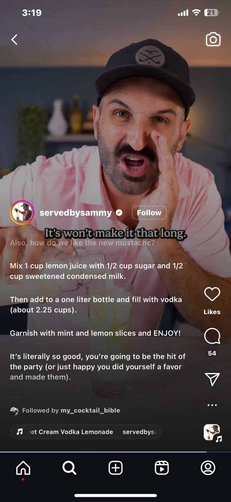

- **1 cup** lemon juice
- **0.5 cup** sugar
- **0.5 cup** condensed milk
- **2.25 cup** vodka

*Method.* whisk till all dissolved. mix

> [source: instagram.com]

`whiskey`

### Thai Milk Tea

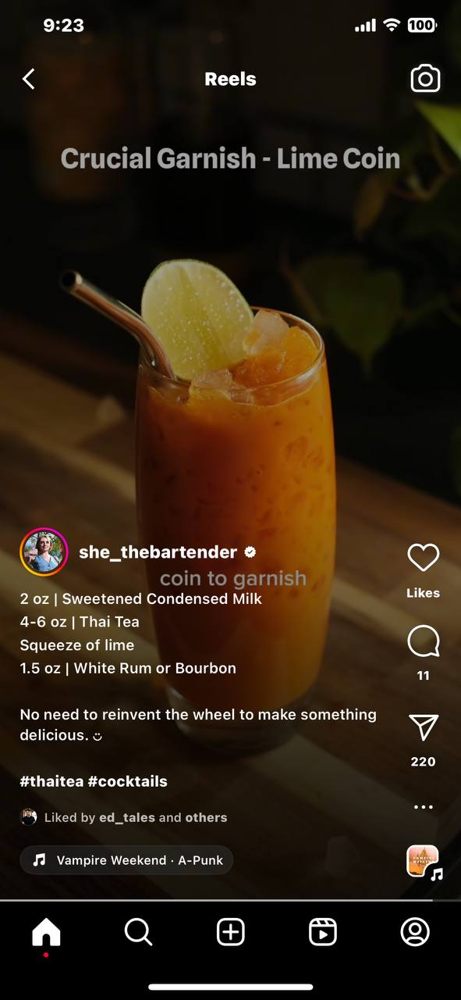

- **2** condensed milk
- **4** Thai tea
- small lime squeeze
- **1.5** white rum/bourbon
- Thai tea:
- **1 cup** loose leaf
- **0.75 cup** sugar
- **4 cup** water

*Method.* do not add lime till tea is added to avoid curdling. simmer 10 min. strain through sieve. second strain through paper towel/cloth. store in bottle and fridge

> [source: instagram.com]

`whiskey`

### · Rum, Cachaça & Cane ·

### Modern Mojito

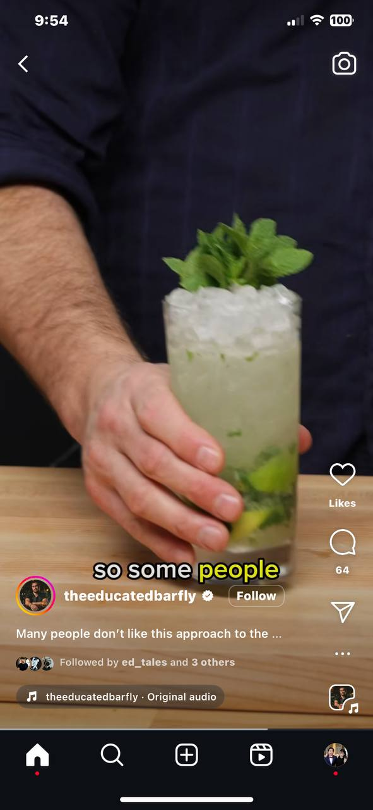

**Method:** Muddled & shaken

- 8-10 mint leaves
- sugar cube
- **0.5** SimpleS
- **5 drop** 20% Saline
- **60 ml** rum (can try with another base)

*Method.* Muddle. crush. Whip shake. Pour ungated into glass. top with ice

> Lime, Eighted and place peel side down [source: instagram.com]

`rum`

### Ocean Water

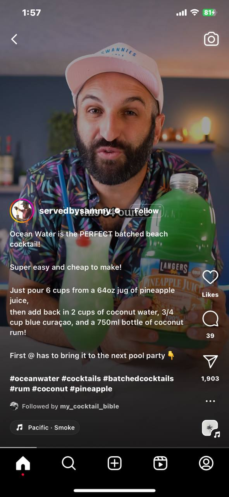

- **2** 500ml PJ
- **2** 500ml CoconutW
- **0.75** 200ml Blue Curac
- **3** 750ml Malibu

*Method.* mix, chill, serve over ice

> [source: instagram.com]

`rum`  `to-try`  `batch`  `tropical`

### Tiramisu Martini

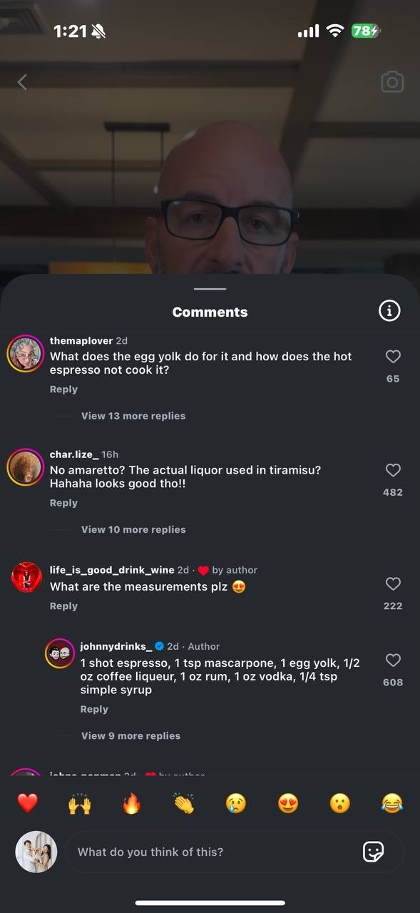

**Method:** Shaken

- 45 hot Espresso
- **1 tsp** Mascarpone
- egg yolk
- **15** Kahlua/Amaretto
- 30 rum
- 30 vodka
- simple syrup optional

*Method.* mix well. hard wet shake and double strain

> [source: instagram.com]

`rum`  `coffee/dessert`

### · Vodka ·

### Crème Brûlée

**Method:** Shaken

- **2 oz** Vanilla Vodka
- **0.25 oz** vanilla Simple syrup
- **2 oz** heavy cream
- **1 tsp** brûléed sugar
- **1** egg white
- Sprinkle sugar and brulee

*Method.* Shake with ice

> [source: instagram.com]

`vodka`

### Dragon Drama

**Method:** Shaken

- **22.5 ml** Spring Dragon syrup
- **200 ml** water
- **200 ml** cane sugar
- **50 g** dried dragonfruit
- **25 g** dried hibiscus
- **25 g** dried elderflower
- **25 g** blueberries
- **15 ml** Peach liqueur
- **60 ml** vodka
- Egg white

*Method.* Shake with ice

> [source: instagram.com]

`vodka`

### New York Cosmopolitan

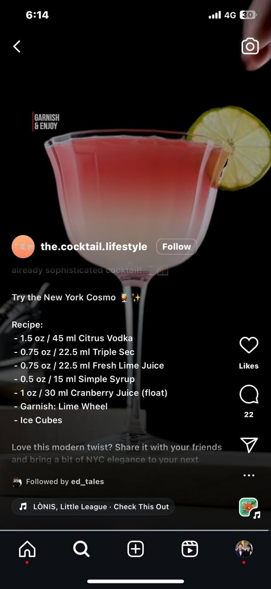

**Method:** Shaken

- **45 ml** Citrus Vodka
- **22.5 ml** Trip Sec
- **22.5 ml** Lime J
- **15 ml** Simple
- **30 ml** Cranberry (float)
- Fresh Lime Wheel (garnish)

*Method.* shake and serve in chilled coupe. cranberry juice float

> [source: instagram.com]

`vodka`

### · Wine, Aperitivo & Sparkling ·

### Tiramisu

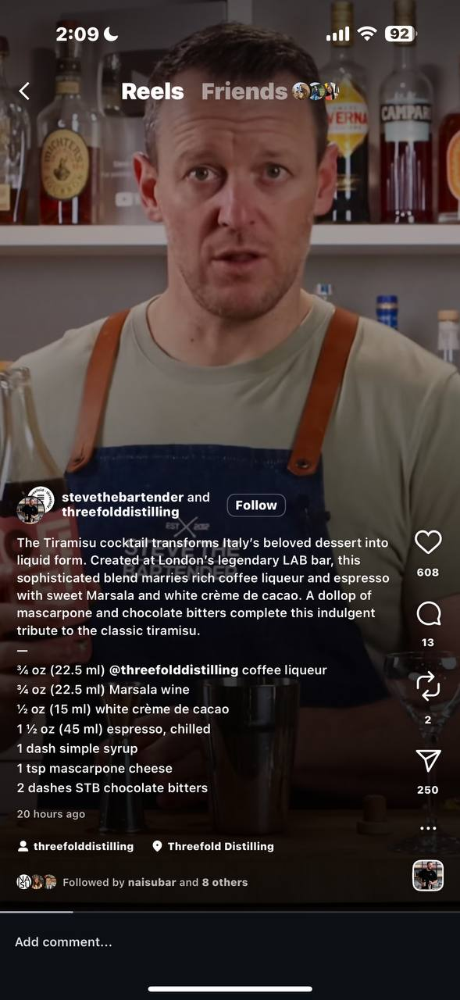

- 22.5 coffee Liqueur (Kahlua)
- 22.5 Masala Wine
- **15** CremeDeCacao
- 45 Espresso
- Dash simple syrup
- **1 tsp** mascarpone
- **2 dash** chocolate bitters

> [source: instagram.com]

`wine`  `coffee/dessert`

### · Liqueurs, Coffee & Other ·

### Aurora Bloom

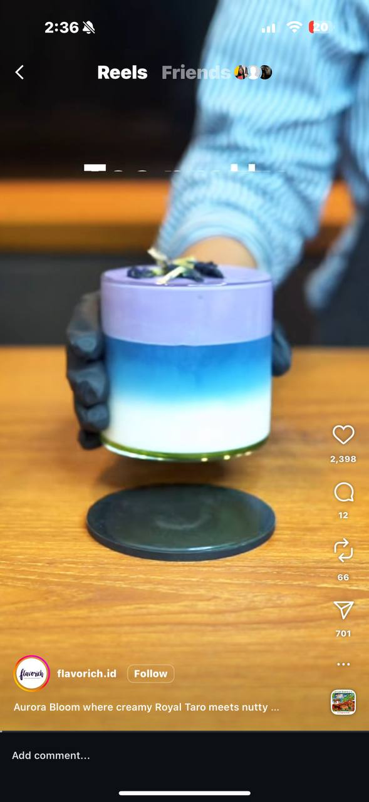

**Method:** Layered

- Large ice cube pour over/layer
- **15 ml** Pistachio syrup
- **120 ml** milk
- **80 ml** Butterfly pea tea/blue curaçao
- **40 ml** whipped ube liquor/ube powder with whipping cream

*Method.* garnish with dried BP flowers

> [source: instagram.com]

`other`

### Blue Mocha

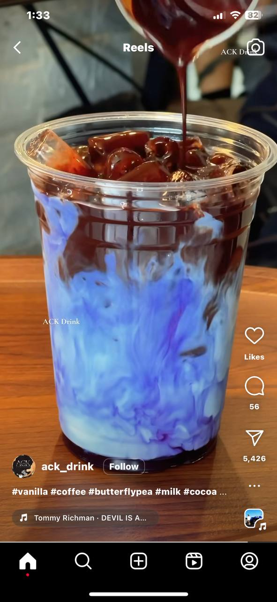

- **30 ml** butterfly pea juice
- **15 ml** Vanilla Syrup
- **60 ml** Freah milk
- **30 ml** Evap milk
- **7 g** cocoa powder + 50ml hot water
- **45 ml** coffee

*Method.* Ice

> [source: instagram.com]

`other`  `coffee/dessert`

### Non Alcoholic Strawberry Matcha

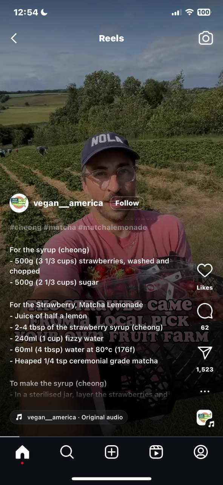

- half a lemonJ
- **3 tbsp** strawberry S
- **1 cup** fizzy water
- **4 tbsp** warm water + heaped 0.25 tsp matcha

*Method.* mix into iced glass

> [source: instagram.com]

`other`  `non-alcoholic`  `coffee/dessert`

---

## 📖 Classics — Reference  (13)

*Standard specs kept for reference (not on the IBA list).*

### 50/50 Martini

**Method:** Stirred

- **1.5** Dry Vermouth
- **1.5** clean vodka

*Method.* ice cold stirring glass and coupe. stir & strain into cold glass. lemon express and zest on rim

`vodka`

### Blue Mule

**Method:** Stirred

- **1.5 oz** vodka
- **0.5 oz** Lime
- **0.5 oz** Blue curaçao

*Method.* stir& top with ginger beer

`vodka`

### Elderflower Gin Sour

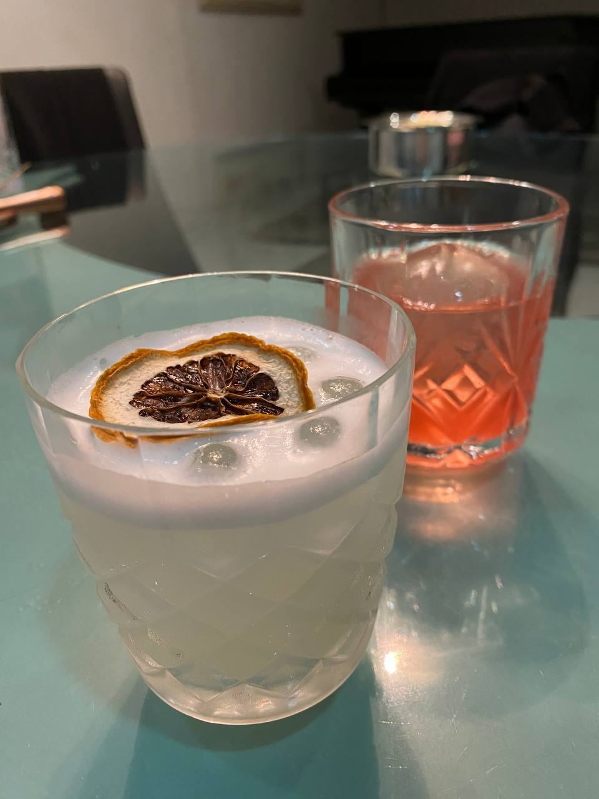

**Method:** Shaken

- **30 ml** Lime Juice
- **15 ml** Elderflower
- **2** Gin
- Eggwhite

*Method.* Dry shake. wet shake. single strained. garnish with dehydrated LemonSlice. would taste nicer to papa if slightly sweeter

`gin`

### Jam Sour

- **2 oz** Spirit
- **2 tbsp** jam
- **30 ml** LeJ
- Egg white
- Fruit garnish to match jam

`other`

### Margarita Sangria

- Ice
- **2 cups** lime
- **2 cups** tequila
- **1.5 cups** agave
- **1 cup** trip sec
- bottle of white
- 4-5 limes

`agave`

### Merry Christmas

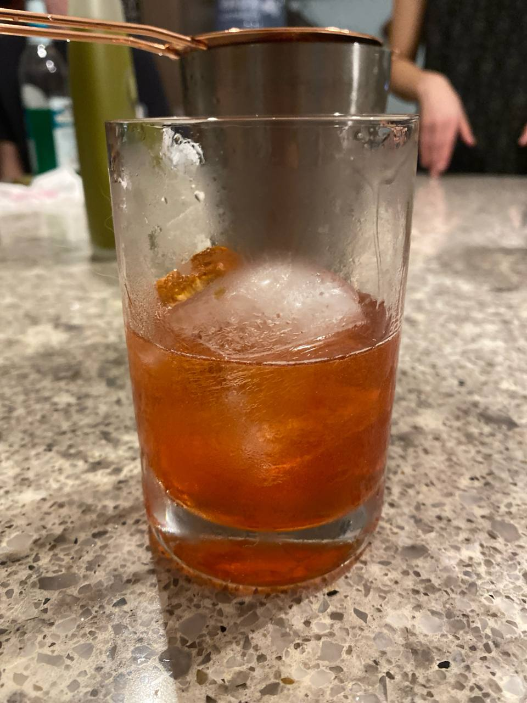

- **60 ml** Cinnamon Gin
- **15 ml** Cheatnut Liqueur
- **10 ml** Agave Nectar
- dehydrated Orange garnish

*Method.* bit sweet - use less sugar. more gold sparkles. very cinammon. can think and prep more garnish (cinnamon and maybe fire)

`agave`  `festive`

### Modern Medicine (penicillin)

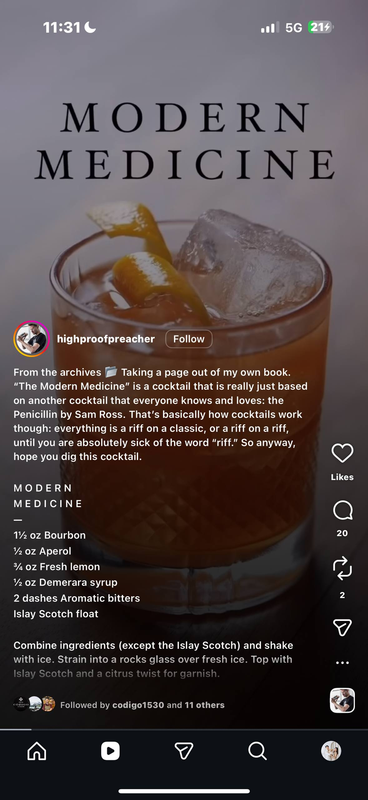

- **1.5** bourbon
- **0.5** aperol
- **0.75** Lemon
- **0.5** Demerara
- **2 dash** Angostura
- scorch float

`whiskey`

### PB&O Mexicano Milkshake

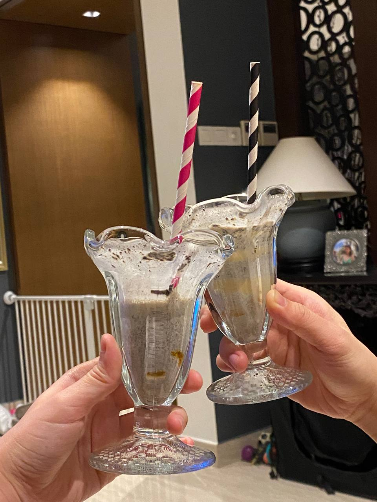

**Method:** Blended

- **15 ml** (tbsp) PB
- **30 ml** Blanco Tequila
- **1 cup** (big scoop) Oreo Icecream

*Method.* blend. Tequila PB rings. good stuff. Boozy n sweet. not cold enough

`agave`

### Smokey Rosemary Paloma

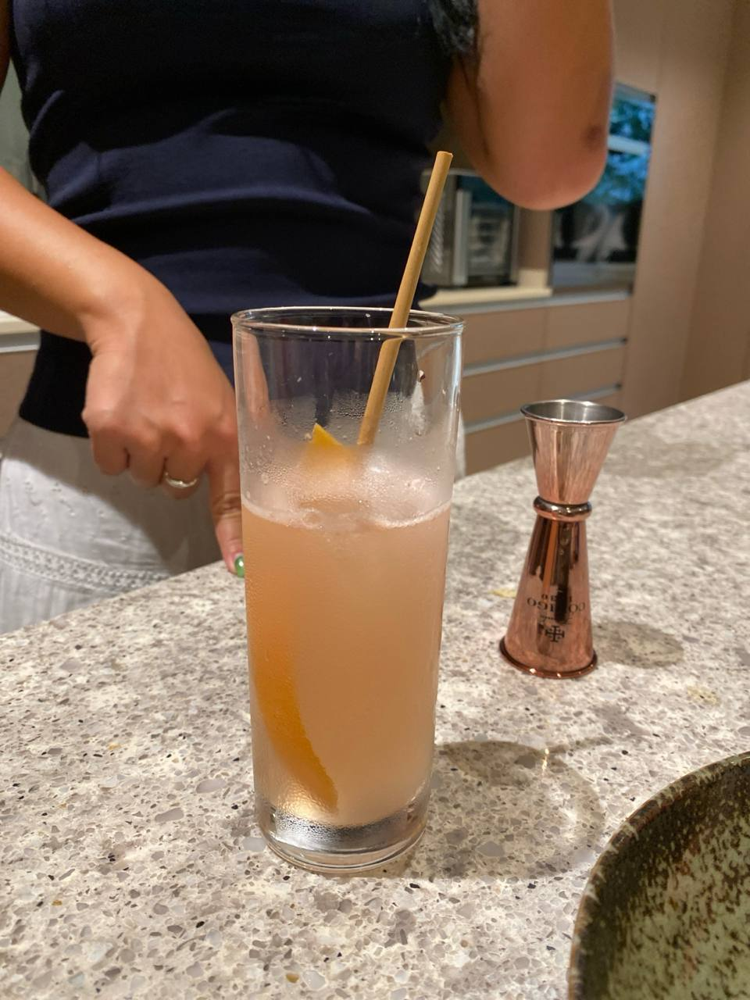

**Method:** Shaken

- Smokey Rosemary Paloma
- **0.75** Rosemary Simple
- **1.5** grapefruit j
- **1.5** Artesanal
- **0.5** Lime j
- **3** tonic water (can use up to 1 if using soda water instead of tonic)
- **3 drops** grapefruit O.S

*Method.* Garnish with a sprig of burnt rosemary. Add to Saturday shakes!. aunty Gwen says can be stronger and less sweet

`agave`

### Spiked Super Limonade

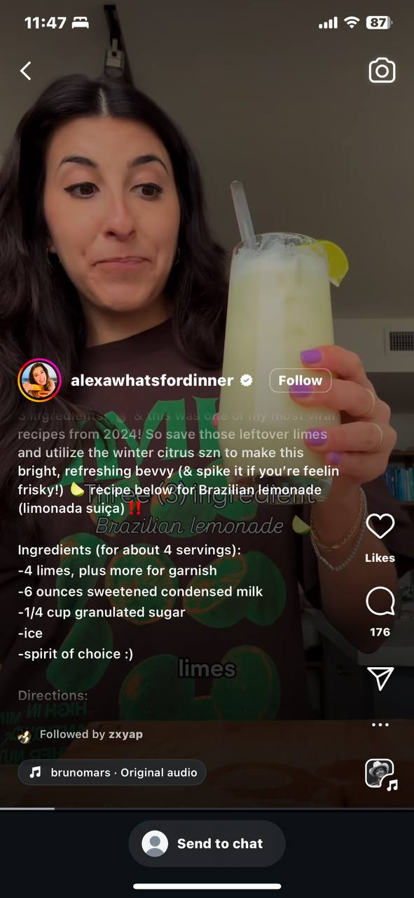

**Method:** Blended

- **4** de-seeded limes
- **180 ml** condensed milk
- **0.25 cup** sugar
- **4 cups** ice
- **2 cups** water
- 60 vodka per serving

*Method.* blend everything except vodka

`vodka`

### Strawberry Coconut (low Alcohol)

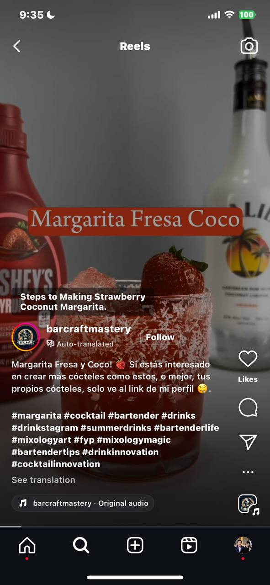

**Method:** Muddled & shaken

- 4fresh strawberries, quartered
- **1.5 oz** Malibu
- **1 oz** Trip Sec/Cointreau
- **1 oz** Lemon J
- **1 oz** StrawB Syrup (Hersheys)

*Method.* Muddle. Wet shake. Serve in shaved coconut rum and strawberry fan garnish

`rum`  `tropical`

### Strawberry Infused Tequila

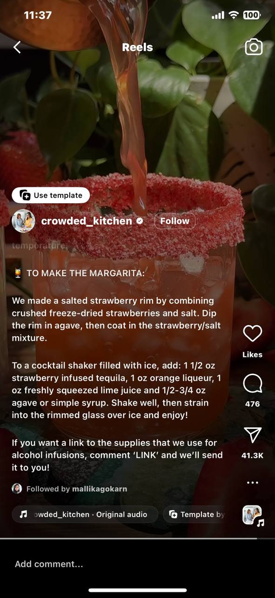

- Strawberry margarita cocktail
- **1.5 oz** strawberry tequila
- **1 oz** Cointreau
- **1 oz** lime juice
- **0.5 oz** agave

*Method.* soak strawberries in tequila for 4 weeks. strain. Strawberries will not be super pleasing to eat

`agave`

### White Gummy Bear

- **2 oz** Pineapple Vodka
- **1 oz** Tequila Blanco
- **1.5 oz** Peach Schnapps
- **0.75 oz** Lemonade (0-sugar)

*Method.* garnish with gummy bears

`agave`  `tropical`  `non-alcoholic`

---

## 🧪 Syrups, Infusions & Techniques  (38)

*Building blocks — syrups, oleo saccharums, milk-punch clarifications, fat-washes, cordials, infusions.*

### Baileys Clarified Cuba Liver

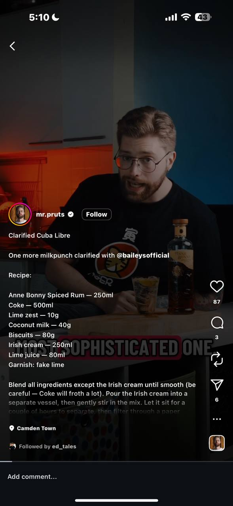

**Method:** Blended

- 250 spiced rum
- 500 coke
- 80 lime juice
- **10 g** lime zest
- **40 g** coconut milk
- **80 g** biscuits
- 250 baileys

*Method.* blend. pour blend into baileys and sit. strain (paper towel and sieve is fine). carbonate?

`syrup/technique`  `batch`  `tropical`  `coffee/dessert`

### Beurre Monte Sauce

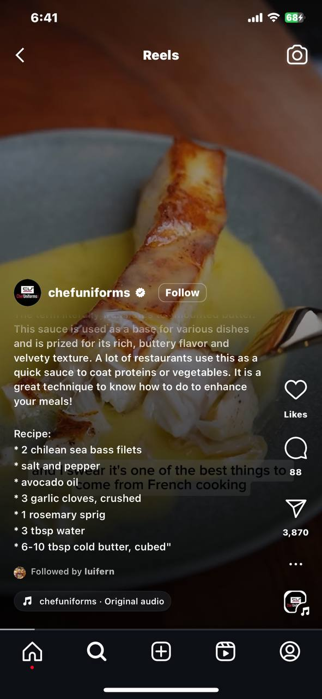

- **3 tbsp** water
- **7 tbsp** butter

*Method.* after cooking protein, add water and reheat pan till simmer. Turn off heat and add cold butter to the liquid. As it melts it’ll emulsify into a creamy sauce

> [source: instagram.com]

`syrup/technique`

### Blue Cheese Elyx Milkpunch

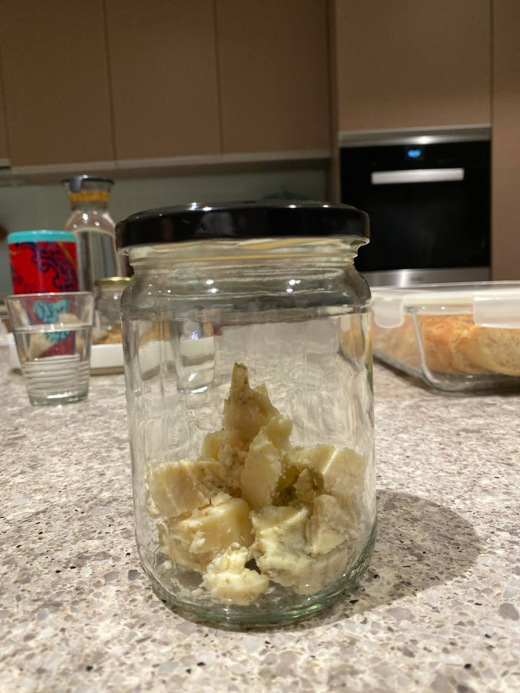

**Method:** Shaken

- **50 g** Blue Cheese
- **300 ml** Elyx
- **120 ml** Milk
- **5 ml** Lime Juice
- Blue Cheese Elyx:
- Milkpunch:

*Method.* Leave Cheese at room temp for 25min to bloom. add vodka and shake to combine. leave to sit for 2.5h. shake then fridge for 5.5h. freeze for 2h. strain with cheese cloth to extract vodka blue cheese (takes 10min). Note: most of the cheese blocks settle at the bottom. Consider crumbling for better flavour infusion. Resulting mixture is a cloudy suspension. add lime juice to start curdling. use mixmaster to gently layer vodka over milk. leave to sit at room temp for 1h. strain with cheesecloth (passes through very quickly. Might have had some issues forming a nice layer of curd. Done in 10min. Re

> Heat milk to 55-60°c (too hot to touch) to denature proteins · swirl well but not too vigorously to combine without splitting curds

`syrup/technique`  `batch`

### Blue Cheese Fat-Wash (technique)

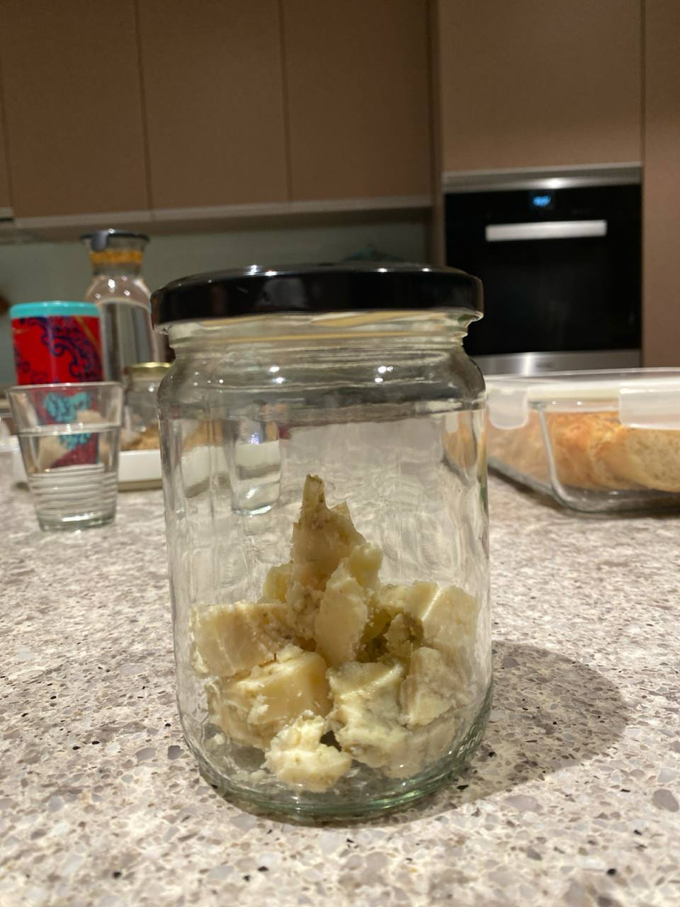

**Method:** Shaken

- Test:
- **5 g** Blue Cheese shaken with 30ml Absolut Elyx
- **5 g** Blue Cheese smeared with 30ml Absolut
- **5 g** Blue Cheese with 30ml Elyx
- **10 g** Blue Cheese with 60ml Absolut (if no difference) or 60ml Elyx
- (To try) Double Agent cocktail:
- Blue Cheese FW Vodka (Absolut)
- Gin
- Lillet Blanc
- Olive

*Method.* See which seperates more easily. See if taste differs significantly

> To fatwash with 470ml Clear Gin/vodka (according to Dave Arnold, Liquid Intelligence: 120g:750ml for strong fat, 240g:750ml for weaker fats) · Note: In fatwashing cheese/peanutbutter, hard shaking might combine too vigorously and make it hard to seperate, losing a lot of cheese volume. Smear on a flat dish and cover with spirit instead. (Freezing doesn't remove soft cheese/PB solids) [source: reddit.com]

`syrup/technique`  `to-try`

### Brown Butter Washed Tequila

- **100 g** butter
- **2.5 ml** vanilla extract

*Method.* brown butter over medium heat (5 on induction). filter and let cool until handleable. add butter and vanilla to jar then pour tequila over. leave to sit for >8h (22 Mar 15:40pm-23:30). freeze to remove butter (23:30-10:30). drip filter (10:50-)

> comes out as a hard block. Easy to remove cap

`syrup/technique`

### Burnt Honey Syrup

- **1 cup** honey
- **1/8 tsp** white vinegar

*Method.* whisk over medium-high heat until boiling (to caramelize). add 1/2 cup water. whisk to combine. over ice to speed up cooling

> [source: instagram.com]

`syrup/technique`

### Caramel Butter Syrup

**Method:** Shaken

- 1) brown 90g of unsalted butter
- 5) fridge to freeze in layers
- 7) 1:1 mix with brown sugar

> 2) finestrain into 200g of hot water · 3) gently Shake to combine (or leave simmering in a sealed jar for more infusion without emulsifying to keep the clear look) · 4) rest at room temp to seperate · 6) strain and coffee filter the water · 8) add a pinch of salt and bottle [source: instagram.com]

`syrup/technique`  `coffee/dessert`

### Carrot Cake Syrup

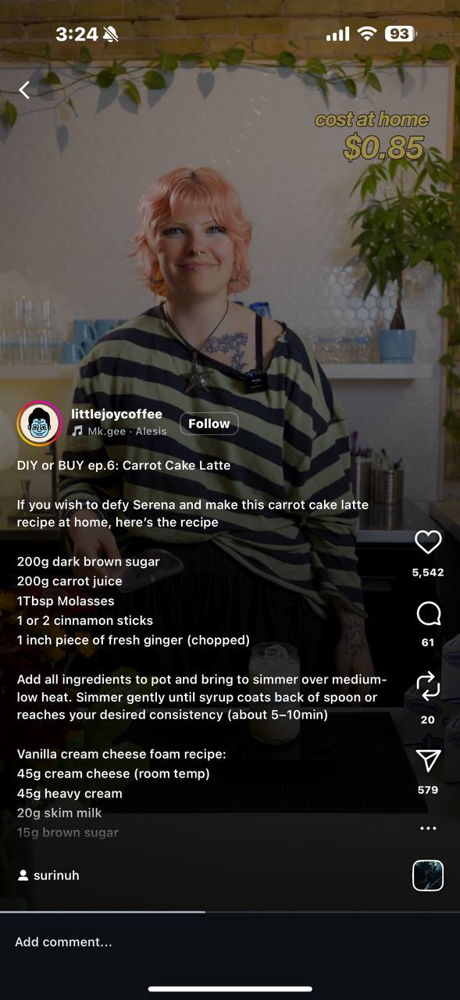

- **100 g** dark brown sugar
- **100 g** carrot juice
- cinnamon stick
- 0.5” fresh ginger
- **0.5 tbsp** molasses

*Method.* simmer over med-low heat until consistency is good

`syrup/technique`

### Charcoal Clarification

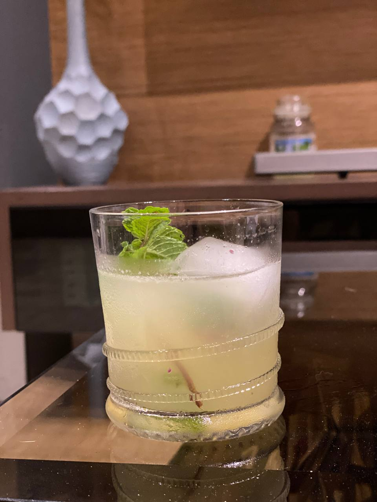

**Method:** Stirred

- **31.5 g** charcoal in 100ml water
- 1L freshly squeezed juice

*Method.* stir to mix. leave for 5-10min. filter

`syrup/technique`  `batch`

### Chilli Oil Washed Tequila

*Method.* remove cap. strain with cheesecloth. fridge to store

> [source: instagram.com]

`syrup/technique`  `batch`  `spicy`

### Cinnamon Bourbon Syrup

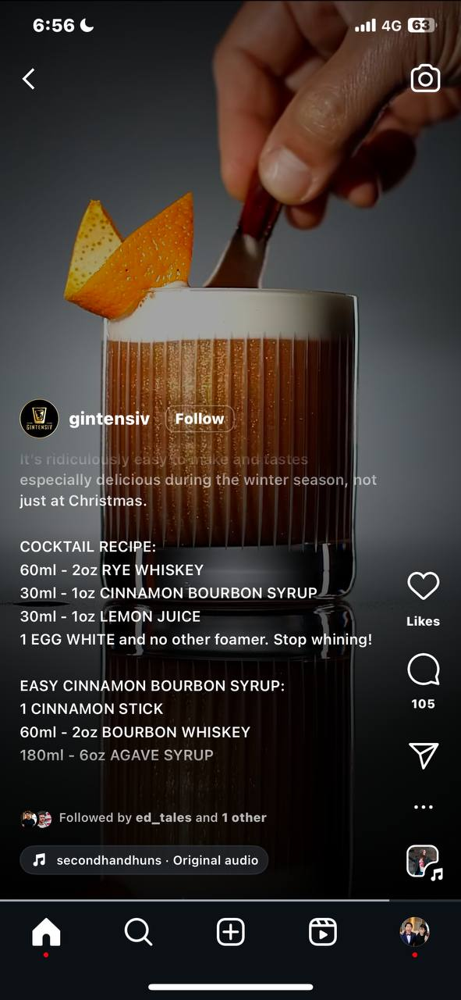

**Method:** Shaken

- **2 oz** bourbon
- **6 oz** agave Syrup
- cinnamon stick
- Cinnamon sour cocktail
- **60 ml** rye whiskey
- **30 ml** cinnabourn syrup
- **30 ml** lemon juice
- Eggwhite

*Method.* shake to dissolve and sit for 24h. dry shake wet shake. garnish with sparkles or cinnamon stick

> [source: instagram.com]

`syrup/technique`

### Citrus Cordial

- **7** lemons
- **7** limes
- **3 cups** water
- **1.5 cups** sugar

*Method.* zest limes (use micro plane, watch video for best practice). blanch (into boiling water for 1 min) then out leave to cool. Keep water for later. juice lemons/limes. add sugar and zest into boiled water then bring back to simmer. add juice and bring to simmer again. strain and bottle to add into cocktails or with fizz. store refrigerated. Should last months

> [source: instagram.com]

`syrup/technique`

### Clarified Verdita

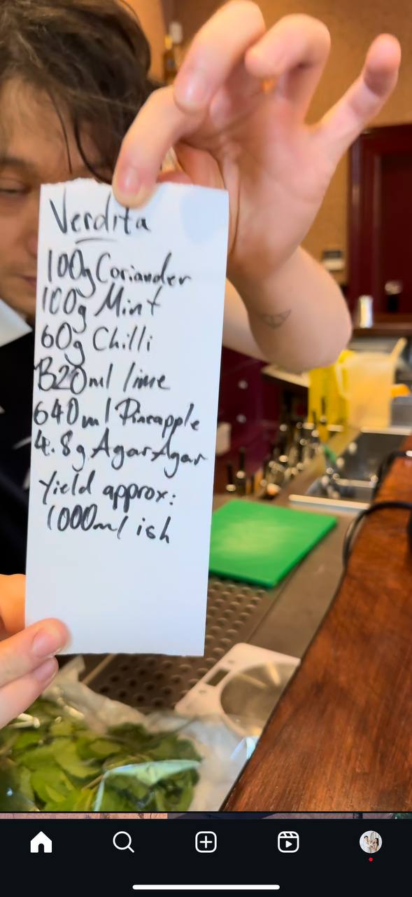

**Method:** Blended

- **100 g** Coriander
- **100 g** mint
- **60 g** chilli
- **320 ml** lime
- **640 ml** PineappleJ
- **4.8 g** Agar
- Shelf stable in fridge

*Method.* Blend, add agar, blend. Strain, wrap, freeze

> Yield ~1L · Heat to 85° for 2min to set agar · Break up, cheese cloth strain. [source: instagram.com]

`syrup/technique`  `batch`  `spicy`  `tropical`

### Gingerbread Syrup

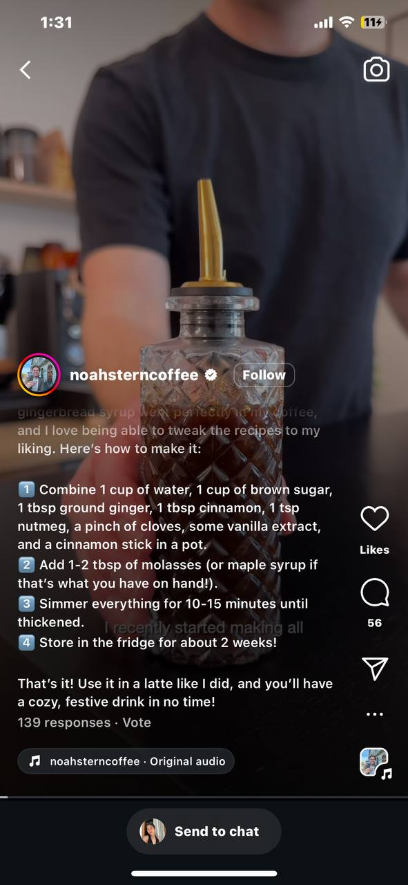

- **1 cup** water
- **1 cup** brown sugar
- **1 tbsp** ginger, cinnamon, nutmeg
- pinch cloves, vanilla extract
- Cinammon stick
- **2 tbsp** molasses (Agave nectar)

*Method.* simmer 10-15min. strain and bottle hot

> [source: instagram.com]

`syrup/technique`  `festive`

### Grapefruit Oleo Saccharum (1:1)

- **60 g** (2 grapefruit) zest (grated)
- **60 g** sugar

*Method.* mix and sit at rtp for 13h. strain is slow - use spoon to squeeze through tea strainer. feels potent. Swirling 10ml blanco in trace remaining makes basically a grapefruit shot. cheesecloth squeeze straining yields extra 10ml. Try putting cheese cloth into piping bag to squeeze (avoids mess on fingers)

> yield ~30ml (not bad)

`syrup/technique`

### Homemade Baileys Recipe

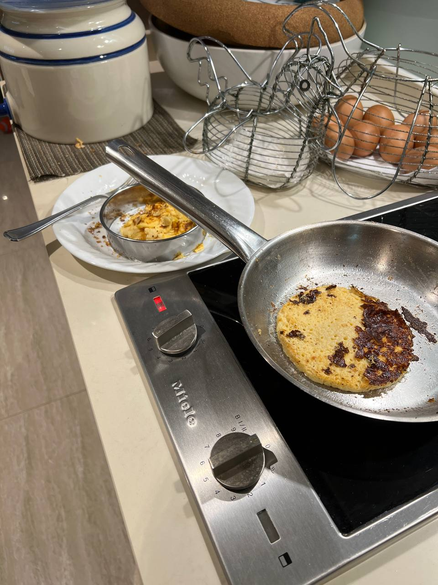

**Method:** Blended

- **2 cup** Irish Whiskey
- **1 cup** milk
- **1 can** condensed milk
- **2 tsp** Vanilla Essence
- **1 tbsp** cocoa powder

*Method.* Blend

> Expires with the milk [source: instagram.com]

`syrup/technique`  `coffee/dessert`

### Homemade Blue Curaçao

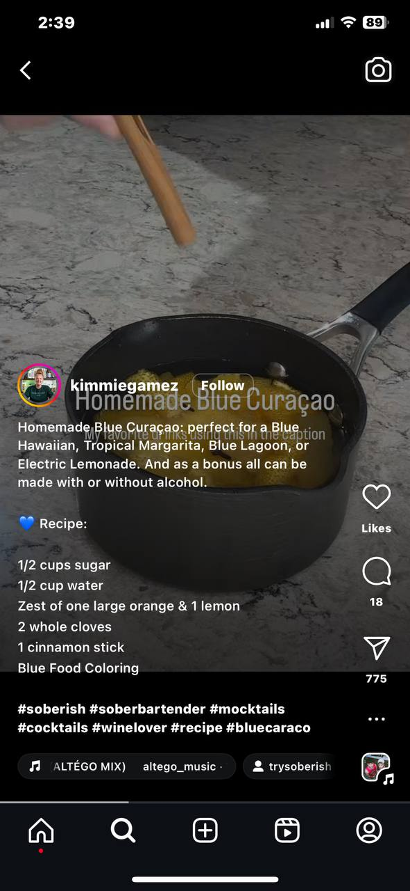

- **0.5 cup** Sugar
- **0.5 cup** water (or just use 0.5cup simples)
- **1** whole orange zest
- **1** whole lemon zest
- **2** cloves
- **1** cinnamon stick

*Method.* Medium heat & boil for 20min

> bottle immediately and add blue colouring (either food dye or butterfly pea concentrate) [source: instagram.com]

`syrup/technique`

### Homemade Matcha Baileys

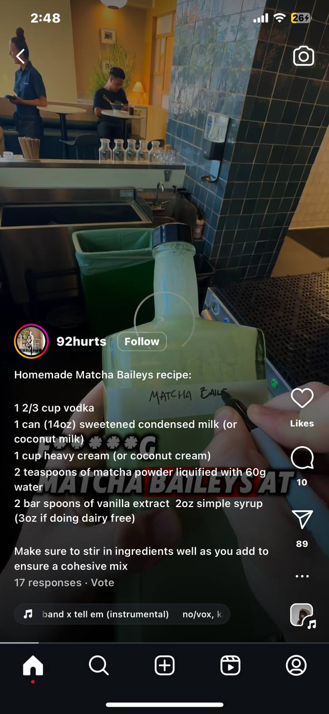

**Method:** Blended

- **4/3 cup** vodka
- **14 oz** sweet condensed milk
- **1 cup** heavy cream
- **2 tsp** matcha powder (60g water)
- **2** bar spoons vanilla extract
- **2 oz** simple syrup

*Method.* Blend well and bottle

> [source: instagram.com]

`syrup/technique`  `coffee/dessert`

### Honey Limoncello (Nicole)

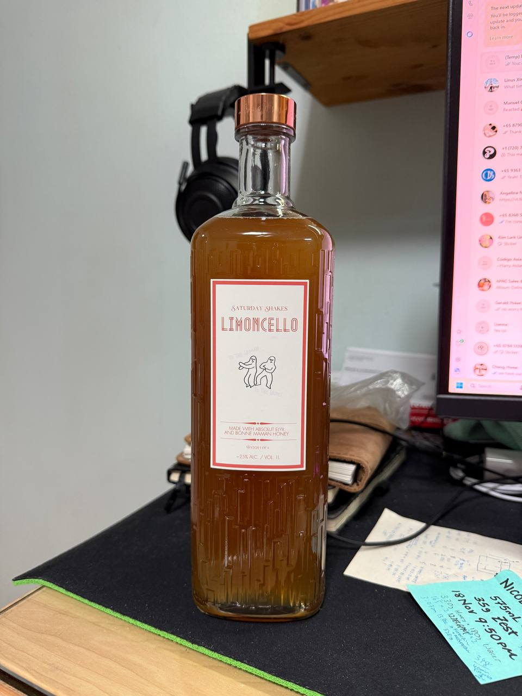

**Method:** Shaken

- **575 ml** Elyx + 35g Zest
- **330 g** Bonne Maman Honey + 180g water

*Method.* shake and sit for 25d (~594h). Yield 520g (~570ml) Lemon vodka. mix and sit for 2d. yield 510g (~416ml) Honey syrup @ 52 brix. solve for target 25abv and 25 brix. topup 27g (~30ml) of Elyx to the full 520g Lemon vodka and 510g Honey syrup. final Yield 1044.5g / 1002.7ml Honey Limoncello. colour is an almost-opaque Amber instead of transparent bright yellow.

`syrup/technique`

### Honeycomb Crunch Garnish

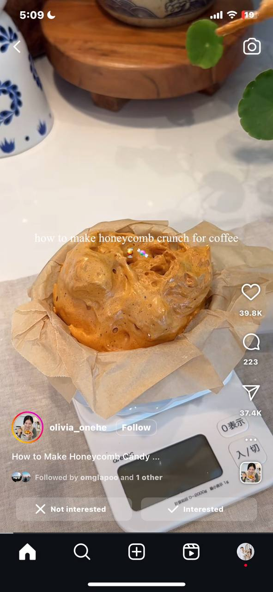

**Method:** Stirred

- **50 g** sugar
- **25 g** water

*Method.* mix but Don’t stir.. microwave for 2min. line bowl/ramekin with parchment paper. microwave and check every 10s until it’s caramelized (brown ). pour into parchment paper bowl. add 3g baking soda and stir quickly to fluff up. leave to cool. extract, remove paper, crumble to use

> [source: instagram.com]

`syrup/technique`

### Lime Cordial

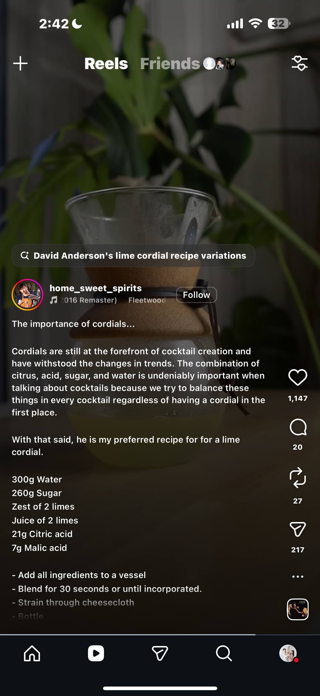

**Method:** Blended

- **300 g** water
- **260 g** sugar
- **2** lime zest
- **2** lime juice
- **21 g** citric
- **7 g** malic

*Method.* blend. cheesecloth. 2 weeks shelf life

`syrup/technique`

### Lime Rich Oleo Sacchrum (2:1)

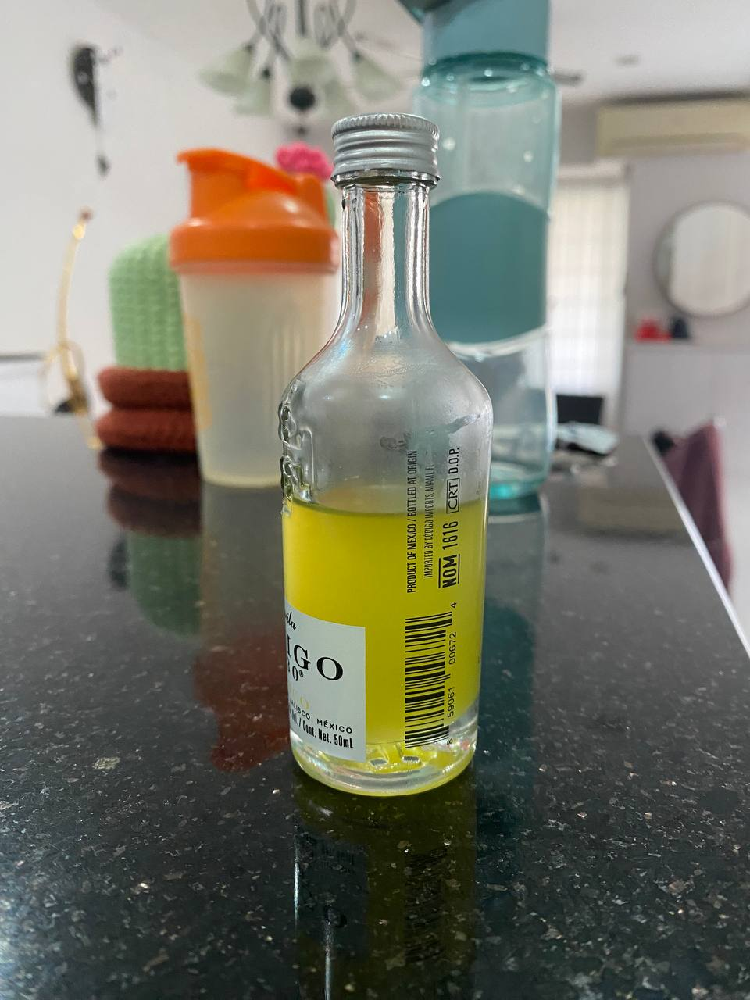

**Method:** Muddled & shaken

- **960 g** (12 Limes) makes about 65g Zest (Leftover 5 limes +~220ml juice)
- **130 g** fine sugar

*Method.* shake and cover for 12h. stirred to reach all sugar. gently muddled at the end. cheesecloth+press strained. consider using finestrainer instead of cheesecloth to improve yield and reduce cloudiness

> be v careful not to dig out the pith. · Yield ~35ml (terrible)

`syrup/technique`

### Lime Super Juice

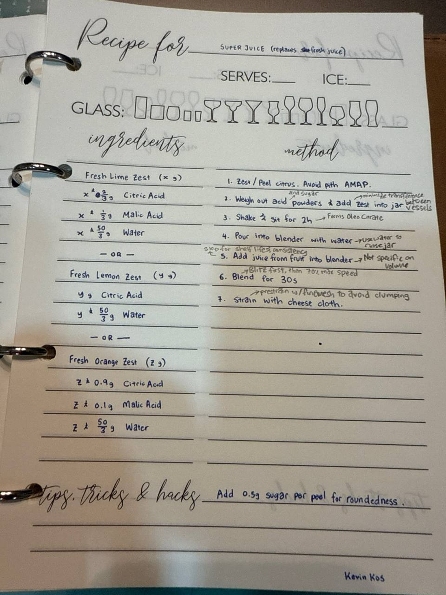

**Method:** Blended

- bought 8 limes (600g @ $4.5/kg)
- bottle and fridge

*Method.* yield 35g peel, 235g/215ml Juice (density of lime juice ~1.09g/ml). add 23.33g Citric and 11.66 Malic and leave to sit in sealed jar for 2h to form oleo citrate. rinse into blender with 583g of cold water. to adding 17.5g sugar in next test (or add later before use)

> seal blender with cling wrap and pulse blitz before 70% max speed for 30s · immediately finestrain to remove pulp and suspension, then strain through a damp cheesecloth to reduce cloudiness

`syrup/technique`

### Limoncello

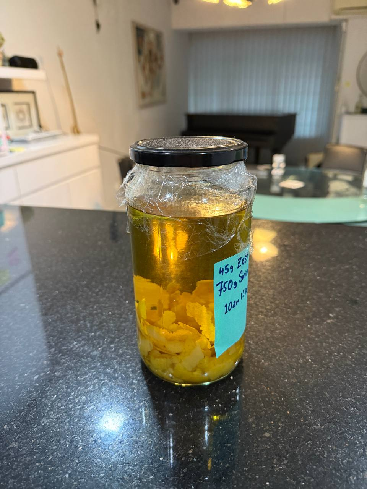

- 1L Vodka
- **7** Lemons (56g zest)
- 1L water
- **1 kg** sugar
- TEST 1 (13 Sep):
- Zest: 8g/lemon
- **45 g** zest + 750ml Smirnoff Blue
- 130925,1000 - 071025,1900 (24d9h)
- **100 g** sugar
- **100 ml** water
- **100 ml** limoncello
- Nicole Limoncello (15 Nov):
- **575 ML** Elyx
- **35 g** Zest

*Method.* Sit for 3 weeks

> (Measure volume and add equal part simple) · TRIAL 1 (7 Oct):

`syrup/technique`  `batch`

### Mexican Apple Pie (Tequila Infusion)

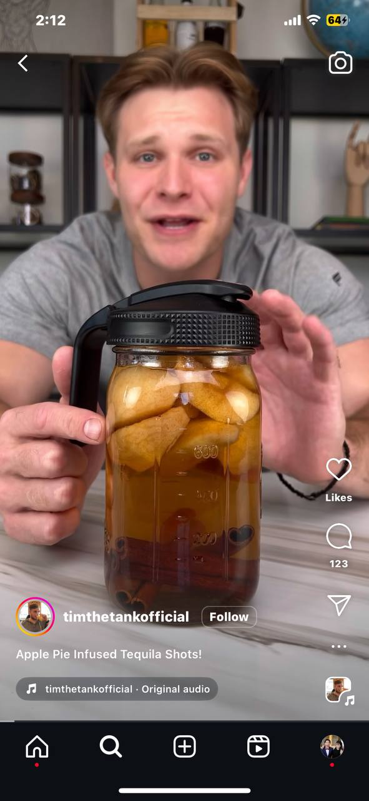

**Method:** Built

- **2** Apples (Peeled, cored, sliced)
- **5** cinnamon sticks
- **200 ml** tequila Blanco

*Method.* sit for 24h then strain. serve topped with apple cider and/or whipped cream w/ cinnamon sprinkle

`syrup/technique`

### Milk Punch Syrup (velvety Simple Syrup)

- **150 ml** whipping cream
- **350 ml** full fat milk
- **22.5 ml** lemon/lime juice
- **240 g** sugar for 1:1

*Method.* Mix and heat until starts to vaporize. Add and wait 30min to curdle. Strain. Mix sugar into strained mix

> Keeps up to 2 weeks [source: instagram.com]

`syrup/technique`  `batch`

### Milkpunching A Fatwash

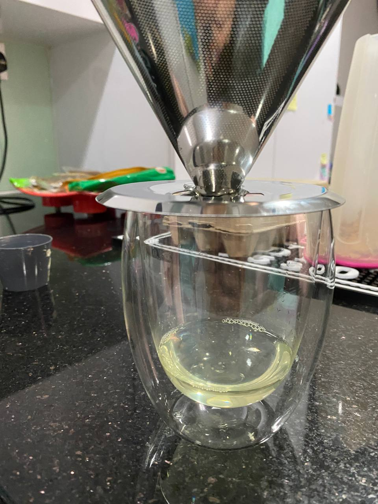

- Ratio:
- Time:
- 2) gently add acid/juice
- 3) swirl

> To avoid leaving a sour taste, use citric acid, or 1:20 ratio for lime juice (5ml:100-120ml milk) · 3milk:10spirit is a good ratio for a milder flavour · or 2:5 for a stronger clarification (like with blue cheese). · Takes same amount of minutes as initial liquid volume · Volume: · increases volume by ~50%milk due to whey from milk. · 1) Heat milk until barely too hot to touch · 4) gently add spirit into the forming curds · 5) swirl to mix wel without disturbing curds · 6) leave at room temp for…

`syrup/technique`  `batch`

### NA Strawberry Milk Punch

**Method:** Blended

- **300 g** strawberry
- **60 ml** Demarara Gum syrup
- **45 ml** Balsamic vinegar (6% acid)
- **225 ml** Warm milk

*Method.* blend to purée. Milk punch and strain. pour over ice or shake and serve. garnish

> chilli powder to taste (for alcoholic burn) [source: instagram.com]

`syrup/technique`  `batch`  `spicy`

### Parsley Oil Garnish (~100ml)

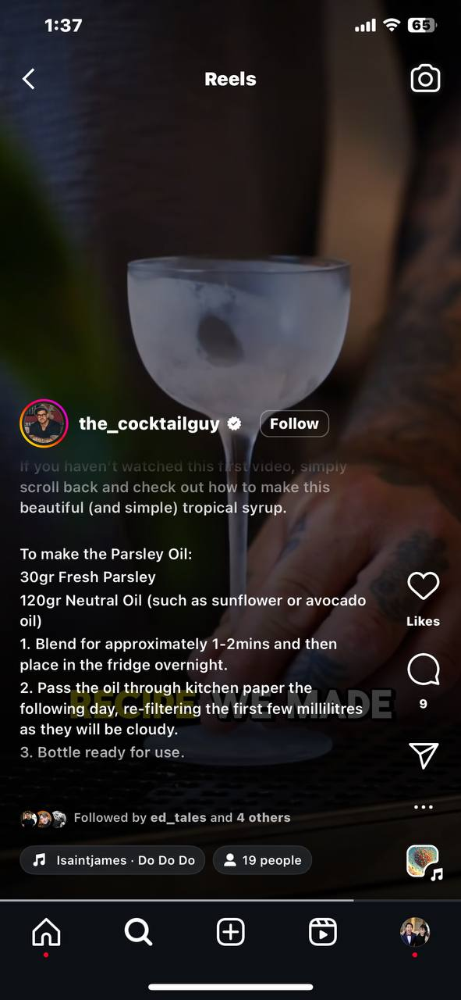

**Method:** Blended

- **30 g** parsley
- **120 g** neutral oil (avocado/sunflower)

*Method.* blend. fridge overnight. strain and restrain. keeps for 2w unless vacuum sealed

> [source: instagram.com]

`syrup/technique`

### Peanut Butter Tequila

- **750 ml** tequila
- **225 g** sugar
- **170 g** peanut
- Pinch of salt
- 375ml
- **100 g** sugar

> Try 1/2 portion with/without sugar [source: imgur.com]

`agave`

### Rich Demerara Cinnamon Syrup

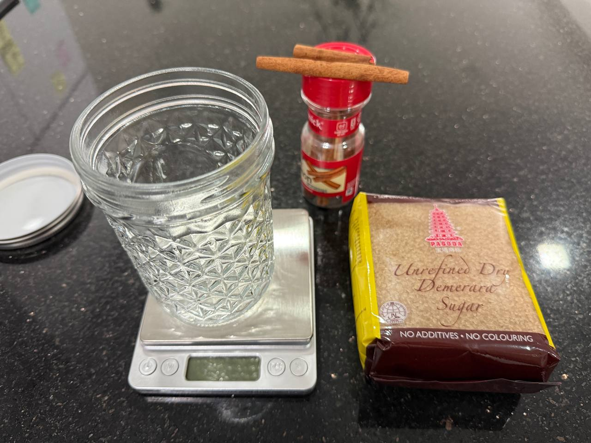

**Method:** Stirred

- **200 g** Demerara sugar
- 1.5*3” sticks McCormicks cinnamon
- **400 g** Demerara Sugar (only have 304g available)
- 3*3" McCormicks Cinnamon

*Method.* Add 100g of cold water to pan and raise heat (8) until it starts to simmer. Keep at simmer (4 > too hot, adding 50ml cold water. Next time simmer at 2)for 6 minutes then seal+cover and bring off heat for 45min. Finestrain (yield: ~95) and add to sugar, top off to 100ml with boiling water. Break up cinnmon and toast on heat:<half until fragrant. Add 200g of cold water to pan and leave on heat:max until it starts to simmer. cover and Bring down to heat:min for 6 minutes.. Leave off heat for 45 minutes. Finestrain (use: 152g) and add to Sugar. warm in waterbath and constantly stir until all sugar

> Break up the sticks and dry toast on medium heat (4) until fragrant · Demerara is not melting. Reheating in water bath (make sure to use paper towel to insulate base of jar and avoid cracking) and topping back up to ideal after · Melts completely in waterbath (constant stirring and glass is manageable to handle). Strainer back and forth to cool and remove brown (cinnamon) sediments and potentially any unmelted crystals. Final yield: 292.5g · TASTE IS AMAZING. ADD TO MENU FOR SURE · (20 Oct'25 TR…

`syrup/technique`

### Rosemary Syrup

**Method:** Stirred

- **200 g** water
- **200 g** sugar
- VERY rosemary-ful. To taste test asap
- Instead of bringing to boil,
- Test 2 (5 Sep):
- 1) weigh gently dried leaves

*Method.* Add everything to pot. Bring to boil, constantly stirring. Steep (0heat) for 10min

> Findings: Slightly green tint on the syrup. Try bringing to boil more quickly then lowering instead of removing heat. Rinse rosemary? Some black particles in syrup after boiling and tea-straining (must use coffee filter or metal finemesh strainer) · Next Test: · Consider rinsing after stripping · Find some way to strip leaves without pressing oils · Froze leaves from previous batch. Used scissors instead of hand stripping. 9g of leaves, with 200g water and 200g sugar · Note: can also make rich s…

`syrup/technique`  `batch`  `coffee/dessert`

### Spiced Ginger Syrup

- **27 g** chopped ginger
- **70 g** packed brown sugar
- **40 g** agave nectar
- **3 g** orange zest
- **1 g** ground cinnamon
- **1 g** ground cloves
- **2 g** ground allspice
- **1/4 tsp** vanilla extract

*Method.* bring to boil. steep for 30min

`syrup/technique`

### Spiced Pineapple Syrup

**Method:** Built

- **200 g** S&W canned pineapple water
- 20 grate nutmeg (no need)
- **55 g** sugar
- **2** cloves
- **60 ml** Blanco
- **30 ml** Fresh Pineapple Juice
- **15 ml** Lime Juice
- **15 ml** Pineapple Tart Syrup (or cinnamon & clove syrup?)

*Method.* bring to boil. stew on 2 for 10min. turn off and sit for 40min. Top with Club Soda. Garnish with Pineapple Leaf & pineapple wedge

> Trial:

`syrup/technique`  `tropical`

### Sweet & Sour Mix

- **50 g** sugar
- **50 ml** water
- **50 ml** Lime Juice
- **50 ml** Lemon juice

> Can also be frozen in cubes for frozen drinks

`other`

### Tea Infusing

*Method.* Add 2g dried tea leaves to 200ml spirit and leave for 45min.

> Milk wash: add 1/4 vol (50ml) milk (if acidic enough, otherwise add some lemon juice before carefully pouring milk) leave to curdle and strain [source: instagram.com]

`syrup/technique`

### Thompson Chilli Agave

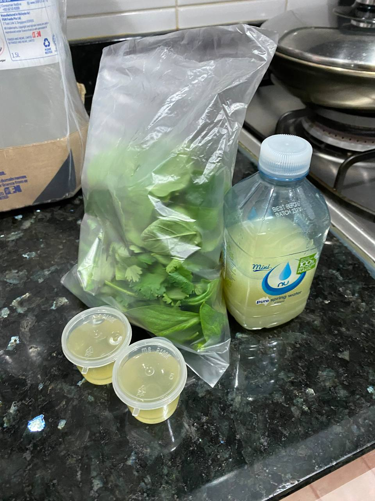

**Method:** Blended

- **132 g** agave syrup (133g agave)
- **45 ml** water (ok)
- **12 g** Chili (12g green chilli padi)
- **113 ml** Water
- **30 g** Chilli
- **330 g** Agave Nectar
- **250 ml** pineapple juice (ok)
- **75 ml** Chili sauce (ok)
- **50 ml** water (ok)
- **15 g** cilantro (13g coriander)
- **10 g** mint (8g Japanese mint)
- **10 g** basil (10g Thai basil)
- Jason Buble
- **375 ml** 1.75 ounce tequila
- **1.5** ounce taco mix (10.875 / 320ml)
- **0.75 oz** Cointreau (5.44 /155ml)
- **0.75 oz** lime juice (150fresh+10limejuice)
- Milk Punch (Michael Derulo)
- Start sitting at 16:30 Saturday

*Method.* chop and sit chilli in water for 10 min. strain water out. stir agave with water and dissolve well. Mix & Blend. Double strain. Add, shake and strain to serve. strain lime juice. add and mix everything except tequila. slowly add mix to 160ml of milk and leave in fridge to curdle. drip strain like normal milk punch. shake 75ml punch + 45ml (~5:3 or 3:2) Blanco and strain over clear ice to serve

> Note: 2.5x uses whole bottle (220ml) of agave (330g) to make 330ml of sauce · Taco mix (~350ml) [30ml spare makes Jason buble] · Jason Buble: 20ml Blanco + 30ml Taco Mix · Thompson SMG: 20ml Chili + 20ml Lime + 45ml Blanco

`agave`  `to-try`  `batch`  `spicy`  `tropical`

### To Try: DIY Baileys

**Method:** Blended

- **800 g** condensed milk
- **120 ml** heavy cream
- **45 ml** honey
- **45 ml** vanilla extract
- **4 g** instant coffee powder
- **12 g** cocoa powder
- **750 ml** Irish whiskey (Jameson)

*Method.* Blend till smooth. keep refrigerated

> Alternate: https://www.instagram.com/reel/DI4opHDzmem/?igsh=MWl5bXd3NW55Nm8wYg== [source: instagram.com]

`syrup/technique`  `to-try`  `coffee/dessert`

---

## 🍳 The Kitchen — Recipes to Try  (13)

### Amatriciana Pasta

- Guancale (cured beef cheek)
- Tomato pasta sauce (plainer the better)
- Chilli flakes
- Round pasta with hole
- Parmeggiano Reggiano
- Start cooking pasta
- Sprinkle cheese :)

*Method.* Slice guancale. Put guancale in pan on low heat until fat reduces into significant liquid. Turn up heat and fry guancale so it gets crispy. Add tomato sauce and chilli flakes. Mix sauce and pasta

> Keep on Low heat and cook until pasta is ready

`spicy`

### Burrata Linguini

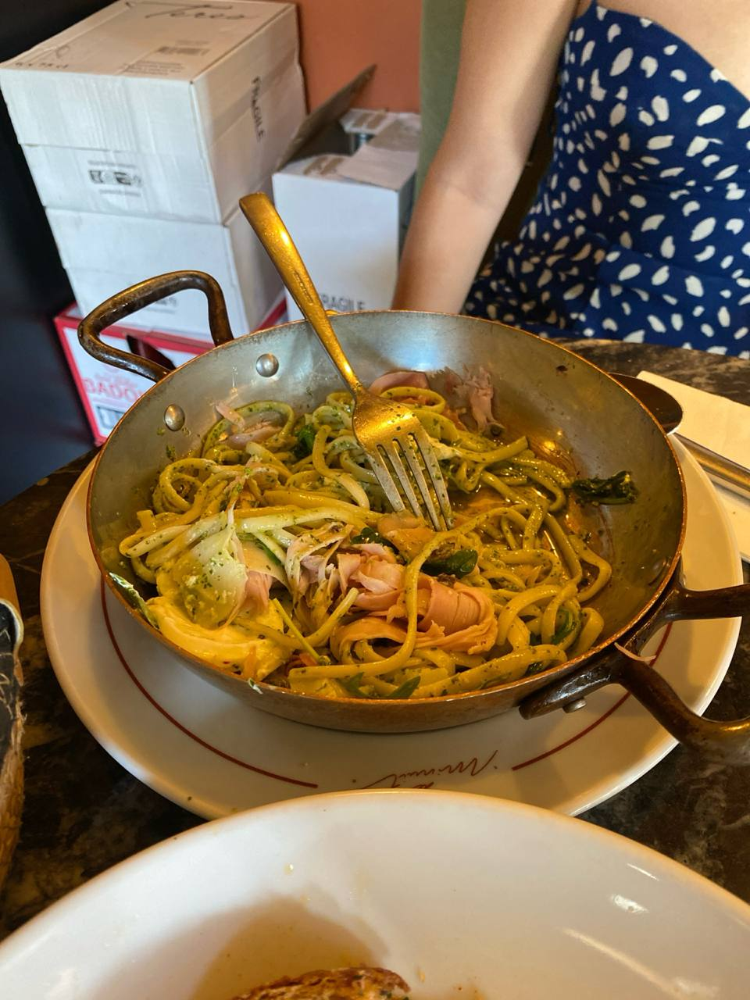

- pesto Linguini
- Burrata
- Ham (white)
- pine nuts
- shaved Parmesan
- greens/rocket

### Cacio E Pepe Pasta

- toast peppercorns
- grind peppercorns into powder
- shave pecorino Romano

*Method.* cook pasta. add some pasta water to cheese and mix over the heat from the pasta pot into a slurry. add pepper powder to sauce. add spaghetti to sauce and stir

> [source: instagram.com]

### DAUPHINOISE

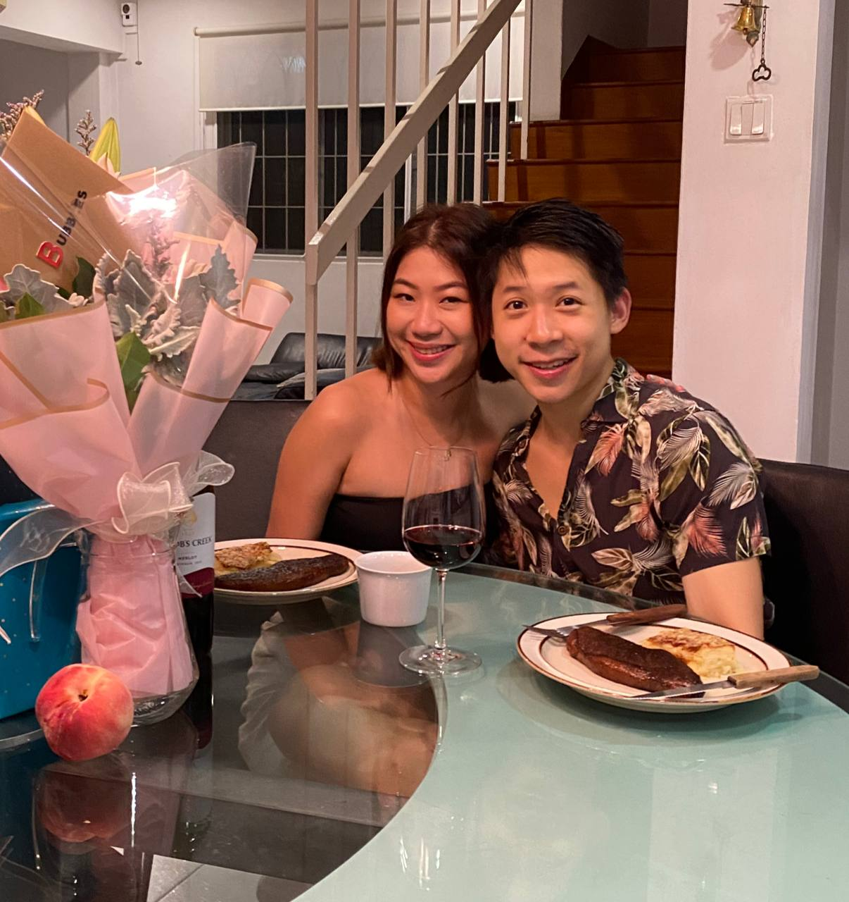

- 1) preheat 180C
- 2) drain water
- 3) cheese top
- 4) oven for 45min
- BEEF
- SAUCE
- Veggies (2min)
- 1) oil in pan
- 2) relatively hot (sizzle level)
- 3) try to fry veggies
- 4) season with salt

> 1) Corn flour slurry (small amount of water · 2) REST IN ALUMINUM AND PUT BACK IN INSULATOR · 1) keep potato water, make corn flour slurry (small water + teaspoon corn flour) · 2) after beef, red wine (about one glass) and simmer down · 3) add pepper corn, corn flour, potato water, keep simmer down. Keep stirring, Don’t overboil. Strain curds if seperate. LOW HEAT · 5) sear on one side, flip and sear other side · 6) add water, lid to cover vegetables (to steam)

### Deep Fried Uhm Milk???

- **500 ml** milk
- **60 g** corn starch
- **20 g** sugar

*Method.* Boil freeze crumb fry

> [source: instagram.com]

### Egg Yolk Croquette

- deepfry

*Method.* roll egg yolks in breadcrumb mix. freeze

> [source: instagram.com]

### French Onion Soup

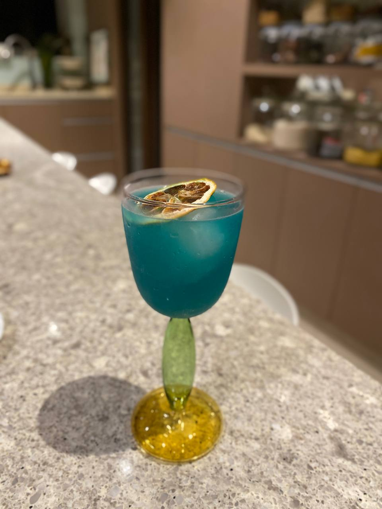

- **500 ml** water + 1 cube veggie stock
- **120 ml** wine
- **1.5 tbsp** soy sauce
- **1.5 tbsp** Miso paste
- **1.02 kg** onion
- 1sq Gruyère per bowl

> Makes way too much soup (about 8 portions)

### Honey Butter Spread

- **100 g** brown sugar
- **100 g** butter
- **50 g** honey
- Pinch salt

*Method.* Bake for 10 minutes to make buttered toast

> [source: instagram.com]

`to-try`

### Lemon Basil Burrata With Garlic Toast

- **8 oz** burrata cheese
- **3** tablespoons olive oil divided
- **1** tablespoon fresh basil sliced
- **1** lemon zested and squeezed
- **1** baguette sliced
- **1** clove garlic halved
- **2** Place the baguette slices onto a baking sheet. Drizzle with 1 tablespoon olive oil and rub with garlic. Place into the oven and bake for 8 to 10 minutes until slightly golden around the edges.
- **4** Place burrata cheese in a small/medium serving bowl and slice open with a knife. Pour the lemon-basil olive oil mixture over the burrata. Serve with garlic toasts

> 1 Preheat the oven to 425 F. · 3 Combine 2 tablespoons of olive oil, basil, lemon zest and juice in a small bowl. [source: instagram.com]

### PAVLOVA

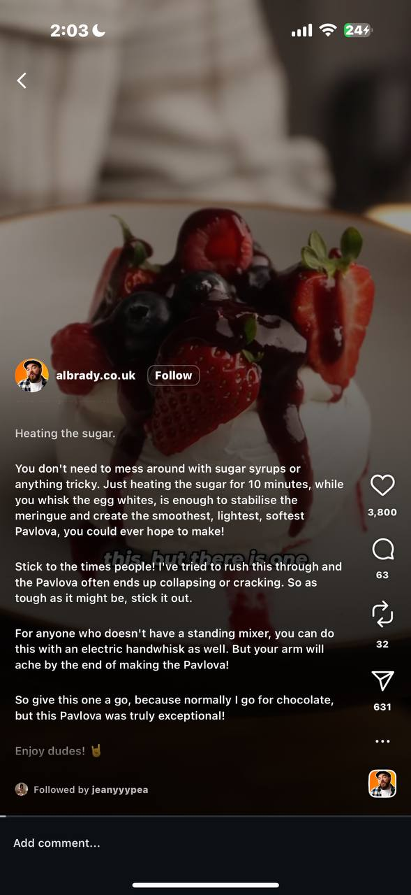

*Method.* Bake sugar at 200°c for 10min. Whip egg whites. Add sugar slowly while still whipping. Whip on high for 20min until stiff peaks. Bake at 90°c for 2h

> [source: instagram.com]

### Ramen Noodle Upgrade - Roasted Garlic

- oil and salt
- 400°F for 35min

*Method.* chop tops off garlic. wrap in aluminum foil. add to ramen broth before boiling

> [source: instagram.com]

### SIGNATURE BROWNIES

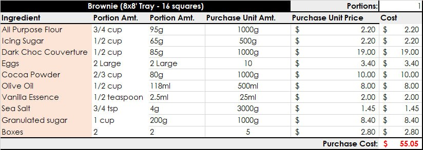

- Cooking Spray (Avocado Oil)
- Parchment Paper
- **1.5 cups** granulated sugar*
- **3/4 cup** all-purpose flour
- **2/3 cup** cocoa powder, sifted
- **1/2 cup** powdered sugar, sifted
- **1/2 cup** dark chocolate chips
- **3/4 tsp** sea salt
- **2** large eggs
- **1/2 cup** canola oil or extra-virgin olive oil**
- **2 tbsp** water
- **1/2 tsp** Vanilla Essence
- 9) Cool for 2h before slicing
- Wait longer = firmer
- Fridge = firmer
- Can be frozen

> 8x8 Baking Dish (this is the one I use so they don't overcook) · 1) Preheat the oven to 325°F. · 2) Lightly spray an 8x8 baking dish (not a 9x9 dish or your brownies will overcook) with cooking spray and line it with parchment paper. · 3) Spray the parchment paper. · 4) Combine the sugar, flour, cocoa powder, powdered sugar, chocolate chips, and salt. · 5) Whisk eggs, olive oil, water, and vanilla. · 6) Sprinkle Dry mix over Wet mix and stir until just combined. · 7) Pour batter into pan and use…

`coffee/dessert`

### SIGNATURE TIRAMISU

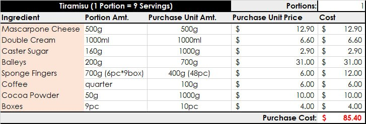

- **1** Portion = 9 650’SKP Boxes
- **500 g** mascarpone cheese
- 1L double cream
- **160 g** caster sugar
- **200 ml** baileys
- **700 g** (54pc) sponge fingers
- **90 ml** baileys
- **630 ml** strong black coffee
- Coffee liquor (optional)
- Cocoa powder for dusting
- 2) Hand mix cheese and sugar
- 1) Thin cream layer
- 2) Fingers (soaked outside)
- 3) Cream
- 4) Cocoa Powder
- 6) Cream
- 7) Cocoa Powder

> 1) Make and cool (small hot water then add room temp water) strong coffee in a shallow dish. > 8g Nespresso in 200g water + 50g Baileys (optional) · 3) Add cream and liquor (not all at once so the splattering is controllable) and Whisk until smooth and you can spatula it out. · 4) Soak the sponge fingers in the coffee (coffe liqueur optional) and start layering. · Note: drizzle after laying to avoid disintegrating while layering · 5) Fingers (drizzle more coffee after layering)

`batch`  `coffee/dessert`

---

*Generated from the Telegram archive “Mike and Nat — Our Stuff.”*
